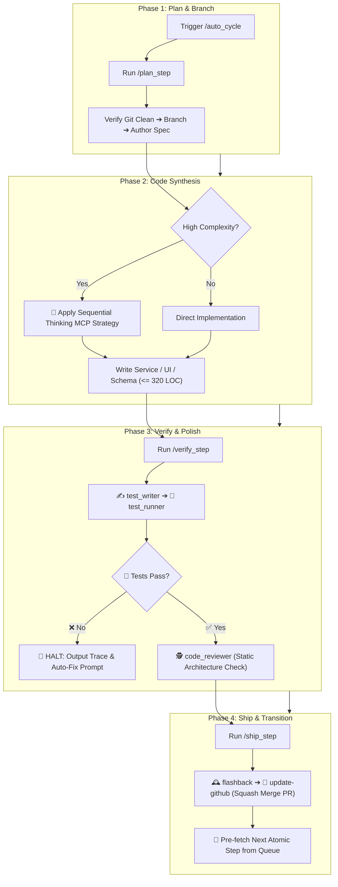

# ♾️ Auto Cycle — Master Autonomous Feature Lifecycle Orchestrator

`auto_cycle` is the overarching development orchestrator for the Safe Yatra project. It connects **[`plan_step`](file:///d:/SIH%202026/.agents/skills/plan_step/SKILL.md)**, **Code Implementation**, **[`verify_step`](file:///d:/SIH%202026/.agents/skills/verify_step/SKILL.md)**, and **[`ship_step`](file:///d:/SIH%202026/.agents/skills/ship_step/SKILL.md)** into a continuous, guarded development loop.

---

## 🔄 The 4-Phase Lifecycle Architecture



---

## 🔒 The 4 Invariant Guardrails & Safety Gates

To guarantee long-term stability and eliminate runaway errors on large codebases, `auto_cycle` enforces four non-negotiable gates:

| Gate | Trigger Condition | Automated Action |
| :--- | :--- | :--- |
| **1. Clean Tree Gate** | Modified or untracked files detected before starting. | **Halts immediately**. Asks user to commit or stash. |
| **2. Context Window Gate** | Turn token consumption exceeds $\sim 75,000$ tokens. | Completes current atomic step, ships PR, and **pauses to start a fresh turn**, preserving 40–50% headroom. |
| **3. Test Failure Gate** | Any pytest / Jest assertion fails during verification. | **Hard stop**. Does NOT review or ship. Outputs failure analysis and single-turn fix prompt. |
| **4. Subagent Boundary Rule** | Subagents are used for parallel testing and code review. | **Subagents never touch Git directly**. All Git commits, pushes, and PR merges are strictly synchronous on the primary agent. |

---

## 📋 Execution Protocol

### Step 1: Planning & Branch Provisioning (`plan_step`)
1. Executes [`plan_step`](file:///d:/SIH%202026/.agents/skills/plan_step/SKILL.md).
2. Identifies the next incomplete Goldilocks step from [`implementation_plan.md`](file:///d:/SIH%202026/implementation_plan.md).
3. Verifies `git status -s`, switches to `main`, pulls latest, and branches off: `feat/<feature-slug>`.
4. Authors the technical specification file in `docs/specs/` or `<module>/docs/`.

---

### Step 2: Implementation & Code Synthesis
1. Implements data models, services, routes, or UI components matching the specification.
2. If Sequential Thinking MCP was recommended in the spec, executes multi-stage hypothesis validation before writing complex spatial or ML math.
3. Adheres strictly to the $\le 320$ LOC limit to avoid bloated commits.

---

### Step 3: Dual Verification & Polish (`verify_step`)
1. Executes [`verify_step`](file:///d:/SIH%202026/.agents/skills/verify_step/SKILL.md).
2. Spawns `test_writer` to author spec-driven unit/integration tests.
3. Spawns `test_runner` to execute the targeted test command.
4. If tests pass, runs `code_reviewer` for static architectural alignment.
5. If issues arise, prompts the user and applies fixes before proceeding.

---

### Step 4: Release, Sync & Loop (`ship_step`)
1. Executes [`ship_step`](file:///d:/SIH%202026/.agents/skills/ship_step/SKILL.md).
2. Logs milestone in [`.agents/memory/flashback.md`](file:///d:/SIH%202026/.agents/memory/flashback.md) and marks task `[x]` in [`implementation_plan.md`](file:///d:/SIH%202026/implementation_plan.md).
3. Creates a conventional commit ($<100$ chars), pushes to GitHub, creates PR, and executes **Squash Merge** into `main`.
4. Cleans up local branch, retains remote branch on GitHub, and queues up the next atomic step.

---

## 📤 Standard Cycle Summary Output

```markdown
# ♾️ /auto_cycle Complete — [Step ID: Feature Title]

### 📊 Lifecycle Execution Summary
- **1. Planning & Spec**: `✓` Created branch `feat/[slug]` and spec `[docs/...md]`.
- **2. Implementation**: `✓` Generated [N] files ([X] LOC total).
- **3. Dynamic Verification**: `✓` [K] tests passed (0 failures).
- **4. Static Review**: `✓` Architecture verified against Safe Yatra invariants.
- **5. Shipping & Memory**: `✓` PR #<N> squash-merged to `main`, `flashback.md` updated.

---

### 🌿 Git & Repository State
- **Current Branch**: `main` (Up to date)
- **Remote Branch**: `origin/feat/[slug]` (Preserved on GitHub)

---

### 🎯 Next Atomic Step in Queue
> **[Next Step ID] — [Next Step Title]** (`[Module Name]`)  
> *Objective: [1-sentence description]*

---

### ⚡ Continue Auto Cycle?
Would you like me to start the next `/auto_cycle` for **[Next Step ID: Next Step Title]**?
```

---

## 🚀 Triggers

- `/auto_cycle`
- `/auto_cycle [step-number] [feature-name]`
- `"Run full autonomous cycle for next feature"`
- `"Execute next step end-to-end"`
