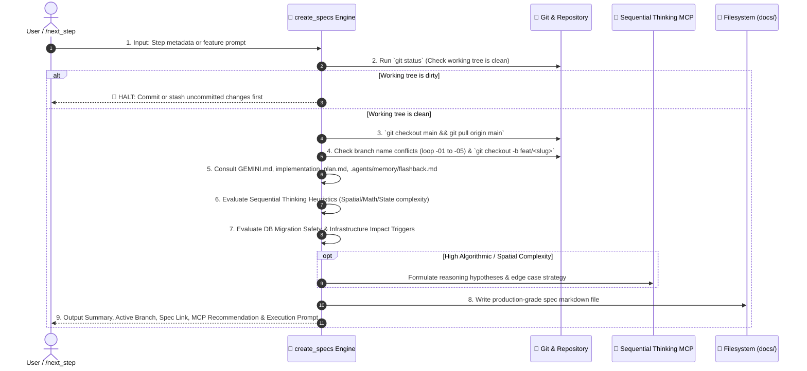

# 📝 Create Specs — Technical Specification & Git Branch Provisioner

`create_specs` is the technical authoring and branch preparation engine for Safe Yatra. It takes a proposed atomic step (from `/next_step` or user input), verifies workspace cleanliness, creates a dedicated Git feature branch off the latest `main`, evaluates algorithmic and spatial complexity for Sequential Thinking MCP acceleration, embeds Database Migration & Infrastructure Impact safety rules when schema/env changes are detected, and generates a rigorous, production-grade technical specification markdown file saved to the module's dedicated `docs/` directory.

---

## 🔒 Step-by-Step Provisioning Workflow



---

## 🛠️ Execution Pipeline

### Step 1 — Check Working Directory Cleanliness

Run:

```bash
git status -s
```

- **Hard Gate**: Check for uncommitted, unstaged, or untracked changes.
- If any modified or untracked files exist, **STOP IMMEDIATELY** and notify the user:
  > _"Working directory has uncommitted changes. Please commit or stash changes before creating a new spec and branch."_
- **DO NOT CONTINUE** until the working directory is clean.

---

### Step 2 — Parse Arguments & Metadata

Extract metadata from `/next_step` handoff or user prompt:

1. `step_number`: e.g. `4.11b`, `5.1a`, `6.2`
2. `feature_title`: Human-readable title in Title Case (e.g. `Periodic Geofence Monitoring Job`)
3. `feature_slug`: Git- and filename-safe slug in lowercase kebab-case (e.g. `step-4-11b-geofence-job`)
4. `module_target`: `backend-spatial` | `ml-risk-engine` | `mobile-app` | `admin-dashboard` | `infra` | `cross-module`
5. `branch_name`: Format `feat/<feature_slug>` (max 40 chars)

---

### Step 3 — Check Branch Name Availability & Conflict Resolution

Run:

```bash
git branch --list "<branch_name>*"
```

- **Conflict Resolution Loop**:
  - If `<branch_name>` does not exist: use `<branch_name>`.
  - If `<branch_name>` exists: iterate suffixes `-01`, `-02`, `-03`, `-04`, `-05` until an unused branch name is found.
  - Set `RESOLVED_BRANCH` to the unique candidate name.

---

### Step 4 — Switch to Main and Pull Latest

Run:

```bash
git checkout main
git pull origin main
```

#### 🚨 Git Error Recovery Protocol:

1. **Pull Merge Conflict**: If `git pull` encounters conflicts with local uncommitted stashes, run `git stash`, pull upstream, and resolve.
2. **Untracked Overwrite**: Move or clean untracked artifacts before checkout.
3. **Upstream Divergence**: If local `main` diverged, verify with `git log --oneline -n 5` before rebasing.

---

### Step 5 — Create and Switch to Feature Branch

Run:

```bash
git checkout -b <RESOLVED_BRANCH>
```

---

### Step 6 — Deep Research & Cross-Referencing

Mandatorily read and verify against:

- 📖 [`GEMINI.md`](file:///d:/SIH%202026/GEMINI.md) — Exact schemas, API contracts, PostGIS geometry types, and WebSocket event names.
- 🗺️ [`implementation_plan.md`](file:///d:/SIH%202026/implementation_plan.md) — Check if the step is already marked complete `[x]`.
- 🕰️ [`.agents/memory/flashback.md`](file:///d:/SIH%202026/.agents/memory/flashback.md) — Canonical living memory ledger, active phase, ADRs, and technical constraints.
- 📁 Existing module files to inspect current imports, types, and dependencies.

---

### Step 7 — Sequential Thinking MCP Decision Heuristics

Evaluate complexity against the following criteria to determine whether to recommend `sequential-thinking` MCP:

#### Complexity Triggers:

1. **Dynamic Risk & ML Scoring**:
   - 4-factor math in `ml-risk-engine` ($0.35 \times \text{weather} + 0.25 \times \text{crowd} + 0.20 \times \text{terrain} + 0.20 \times \text{history}$).
   - Confidence scoring, exponential decay weighting, time-decay functions, and anomaly thresholds.
2. **PostGIS & Spatial Geometry**:
   - `ST_DWithin` spatial sphere queries, spatial volunteer/police matching in `backend-spatial`.
   - Geofence point-in-polygon ray-casting / `ST_Contains` geometry calculations.
   - Dynamic danger corridor boundary calculations and multi-point route danger aggregation.
3. **Multi-State Transactional Chains & State Machines**:
   - SOS lifecycle state transitions (`TRIGGERED` $\rightarrow$ `VOLUNTEER_ALERTED` $\rightarrow$ `VOLUNTEER_ACCEPTED` $\rightarrow$ `VOLUNTEER_ARRIVED` $\rightarrow$ `RESOLVED` / `CANCELLED`).
   - Transaction rollbacks, distributed idempotency keys, and distributed lock mechanics.
4. **Offline Sync & Distributed Telemetry**:
   - Offline SMS bitmask payload encoding/parsing, GPS telemetry reconciliation, or Redis-to-Postgres cache sync.

#### Action on Match:

- When a task matches ANY complexity trigger:
  1. Include `## 3. 🧠 Sequential Thinking Strategy` in the spec.
  2. Add recommendation prompt in output summary.
  3. During implementation, invoke `call_mcp_tool` with `ServerName: "sequential-thinking"` and `ToolName: "sequentialthinking"` for deep iterative deduction.

---

### Step 8 — Database Migration & Infrastructure Impact Evaluator

Evaluate whether the feature impacts database schemas or developer infrastructure:

#### A. Database Migration Triggers:

- Modifies `backend-spatial/prisma/schema.prisma` or `prisma/migrations/`.
- Alters PostGIS geometry columns (`Point`, `Polygon`, SRID 4326).
- **Mandatory Actions**:
  - Require GiST spatial indexing (`@@index([geom], type: Gist)`).
  - Enforce SRID 4326 `[lng, lat]` storage ordering.
  - Require zero-downtime safe columns (`?` or `@default(...)`).
  - Document rollback feasibility.

#### B. Infrastructure Impact Triggers:

- Requires new environment variables in `.env.example`, `src/config/env.ts`, or `app/config.py`.
- Modifies `docker-compose.yml` (e.g. ports, Redis configuration, volume mounts).
- Adds new dependencies to `package.json` or `requirements.txt`.

---

### Step 9 — Destination Path Determination

Save the specification file to the established module-specific path:

| Scope                          | Destination Path                         |
| :----------------------------- | :--------------------------------------- |
| **Cross-Module / Core System** | `docs/specs/<feature_slug>.md`           |
| **Backend Spatial Server**     | `backend-spatial/docs/<feature_slug>.md` |
| **ML Risk Engine**             | `ml-risk-engine/docs/<feature_slug>.md`  |
| **Mobile App**                 | `mobile-app/docs/<feature_slug>.md`      |
| **Admin Dashboard**            | `admin-dashboard/docs/<feature_slug>.md` |

> [!NOTE]
> **Historical Spec Compatibility**: Older legacy specs (e.g. Steps 2.x) were saved flat at `docs/<slug>.md`. Newer specs (Steps 3.x+) reside under `docs/specs/<slug>.md` or `<module>/docs/<slug>.md`. When reading or cross-referencing existing specs, agents should check both locations.

---

### Step 10 — Author the Specification File

The generated markdown spec file MUST follow this exact structure:

````markdown
# 📄 Technical Specification: [Feature Title]

> **Step ID**: `[Step ID]`  
> **Target Module**: `[Module Name]`  
> **Git Feature Branch**: `[branch_name]`  
> **Status**: 📋 Draft / Ready for Implementation  
> **Created**: YYYY-MM-DD

---

## 1. Executive Summary

[2-3 sentence overview of what is being built, the problem it solves, and why it sits at this stage of the Safe Yatra roadmap.]

---

## 2. Dependencies & Prerequisites

- **Depends on**: [List of previous steps, models, or packages required]
- **Blocked by**: [None or specific prerequisite]
- **New Packages / Libraries**: [List of npm/pip packages to install, or 'None']

---

## 3. 🏗️ Infrastructure & Environment Impact

- [ ] **Environment Variables**: [List new env vars needed in .env / env.ts, or 'None']
- [ ] **Docker Compose**: [Any port / service / volume updates, or 'No changes']
- [ ] **Package Dependencies**: [New packages to install, or 'None']

---

## 4. 🧠 Sequential Thinking Strategy _(Optional / Recommended for High Complexity Tasks)_

- **Core Reasoning Hypotheses**: [Hypotheses to systematically validate during implementation, e.g. coordinate projection correctness (SRID 4326), weighting factor normalization to 1.0]
- **Spatial / Algorithmic Edge Cases**: [Edge cases requiring formal deduction: zero-division, boundary crossing on vertex, concurrent volunteer acceptance race condition]
- **State & Invariant Proofs**: [State machine transition legality matrix, transactional idempotency constraints]

---

## 5. 🗄️ Database & Migration Safety Checklist _(Included if touching schema/DB)_

- [ ] **GiST Spatial Index**: Geometry columns have `@@index([...], type: Gist)`.
- [ ] **Coordinate SRID 4326**: Stored strictly as `[lng, lat]`.
- [ ] **Zero-Downtime Safe**: New columns are nullable or have default values.
- [ ] **Rollback Feasibility**: Documented rollback plan (`npx prisma migrate resolve` or down SQL).

---

## 6. Data Contracts & Schema Specifications

### 6.1 Data Models & Types

```typescript
// Concrete interface, Zod schema, or Pydantic model definition
```
````

### 6.2 API Endpoints / WebSocket Events (if applicable)

| Protocol | Method / Event | Path / Room   | Auth Required | Description         |
| :------- | :------------- | :------------ | :------------ | :------------------ |
| REST     | `POST`         | `/api/v1/...` | `Bearer JWT`  | [Description]       |
| WS       | `emit`         | `zone:{id}`   | Yes           | [Event description] |

#### Request Payload:

```json
{ ... }
```

#### Response Payload (`ok()` envelope):

```json
{
  "success": true,
  "data": { ... },
  "error": null
}
```

---

## 7. Step-by-Step Implementation Sequence

1. **Phase A: Types & Validation**
   - [ ] [Task 1: Define types in `types.ts` / `schemas/request.py`]
2. **Phase B: Core Logic & Service Layer**
   - [ ] [Task 2: Implement service methods with AppError exception handling]
3. **Phase C: Routes & Controllers**
   - [ ] [Task 3: Implement controller with ok()/fail() and mount in `index.ts`]
4. **Phase D: Tests & Verification**
   - [ ] [Task 4: Write unit/integration test in `tests/`]

---

## 8. Edge Cases & Failure Recovery

- **Network / Service Timeout**: [Handling external API timeouts with Redis cache or defaults]
- **Validation Errors**: [Return standard `fail(res, 'VALIDATION_ERROR', ...)` envelope]
- **Offline Fallback**: [SMS trigger or local cache behavior if offline]

---

## 9. Verification & Acceptance Criteria

### Automated Tests

```bash
# Targeted test execution command
npm test -- tests/...test.ts
# or
pytest tests/test_...py -v
```

### Acceptance Checklist

- [ ] [Test condition 1 passes]
- [ ] [Test condition 2 passes]
- [ ] [No TypeScript compiler or linter errors]

````

---

## 📤 Standard Output Format

```markdown
### 📌 Feature Summary: [Feature Title]
- **Module**: `[module-target]`
- **Scope**: [1-2 bullet points summarizing the technical scope]
- **Key Files**: List of `[NEW]` and `[MODIFY]` target files.

---

### 🧠 Sequential Thinking MCP Recommendation
*(Include if task meets high complexity heuristics)*
> 🧠 **Recommendation**: Use Sequential Thinking MCP for multi-stage reasoning on **[Complex Area]** (`Approve` / `Skip`).

---

### 🗄️ Database & Infrastructure Safety
*(Include if task touches DB schema or environment)*
> 🗄️ **Safety Checked**: GiST spatial index required, zero-downtime nullability verified, environment variables documented.

---

### 🌿 Git Feature Branch
`[branch_name]` *(Created and checked out from latest main)*

---

### 📁 Technical Spec Created
- [path/to/spec.md](file:///d:/SIH%202026/backend-spatial/docs/spec.md)

---

### ⚡ Ready to Implement?
Would you like me to begin executing the implementation tasks in this specification?
````

---

## 🚀 Triggers

- `/create_specs [step-number] [feature-name]`
- `/create-spec [feature-name]`
- `"Create spec for periodic geofence monitoring"`
- Automatic invocation from `/next_step`
