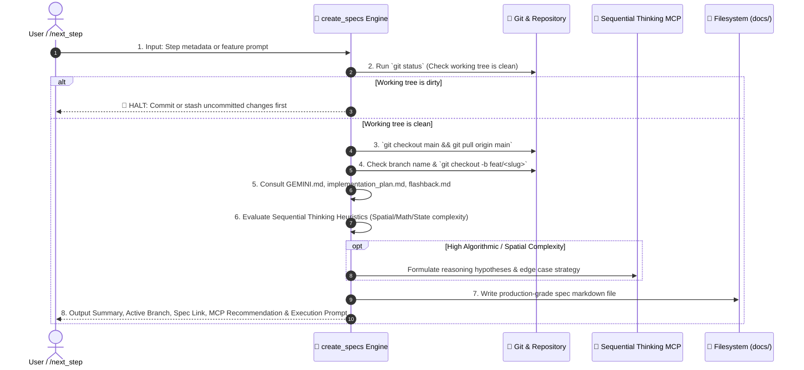

# 📝 Create Specs — Technical Specification & Git Branch Provisioner

`create_specs` is the technical authoring and branch preparation engine for Safe Yatra. It takes a proposed atomic step (from `/next_step` or user input), verifies workspace cleanliness, creates a dedicated Git feature branch off the latest `main`, evaluates algorithmic and spatial complexity for Sequential Thinking MCP acceleration, and generates a rigorous, production-grade technical specification markdown file saved to the optimal location in the repository.

---

## 🔒 Step-by-Step Provisioning Workflow



---

## 🛠️ Execution Pipeline

### Step 1 — Check Working Directory is Clean
Run:
```bash
git status -s
```
- **Hard Gate**: Check for uncommitted, unstaged, or untracked changes.
- If any modified or untracked files exist, **STOP IMMEDIATELY** and notify the user:
  > *"Working directory has uncommitted changes. Please commit or stash changes before creating a new spec and branch."*
- **DO NOT CONTINUE** until the working directory is clean.

---

### Step 2 — Parse Arguments & Metadata
Extract the following metadata from the `/next_step` handoff or user prompt:
1. `step_number`: e.g. `0.3`, `1.1`, `2.2`, `4.9`
2. `feature_title`: Human-readable title in Title Case (e.g. `Offline SOS SMS Fallback`)
3. `feature_slug`: Git- and filename-safe slug in lowercase kebab-case (e.g. `offline-sos-sms-fallback`)
4. `module_target`: `backend-spatial` | `ml-risk-engine` | `mobile-app` | `admin-dashboard` | `infra` | `cross-module`
5. `branch_name`: Format `feat/<feature_slug>` or `feat/step-<step_number>-<feature_slug>` (max 40 chars)

---

### Step 3 — Check Branch Name is Available
Run:
```bash
git branch
```
- If `branch_name` already exists, append a sequence suffix: `<branch_name>-01`, `<branch_name>-02`, etc.

---

### Step 4 — Switch to Main and Pull Latest
Run:
```bash
git checkout main
git pull origin main
```

---

### Step 5 — Create and Switch to Feature Branch
Run:
```bash
git checkout -b <branch_name>
```

---

### Step 6 — Deep Research & Cross-Referencing
Mandatorily read and verify against:
- 📖 [`GEMINI.md`](file:///d:/SIH%202026/GEMINI.md) — Exact schemas, API contracts, PostGIS geometry types, and WebSocket event names.
- 🗺️ [`implementation_plan.md`](file:///d:/SIH%202026/implementation_plan.md) — Check if the step is already completed `[x]`. If marked complete, warn the user and stop.
- 🕰️ [`.agents/memory/flashback.md`](file:///d:/SIH%202026/.agents/memory/flashback.md) — Relevant ADRs and technical constraints.
- 📁 Existing module files to inspect current imports, types, and dependencies.

---

### Step 7 — Sequential Thinking MCP Decision Heuristics
Evaluate the complexity of the feature against the following criteria to determine whether to recommend the `sequential-thinking` MCP tool:

#### Complexity Triggers:
1. **Dynamic Risk & ML Scoring**:
   - 4-factor math in `ml-risk-engine` ($0.35 \times \text{crime} + 0.30 \times \text{time} + 0.20 \times \text{lighting} + 0.15 \times \text{density}$).
   - Confidence scoring, exponential decay weighting, time-decay functions, and anomaly thresholds.
2. **PostGIS & Spatial Geometry**:
   - `ST_DWithin` spatial sphere queries, spatial volunteer/police matching in `backend-spatial`.
   - Geofence point-in-polygon ray-casting / `ST_Contains` geometry calculations.
   - Dynamic danger corridor boundary calculations and multi-point route danger aggregation.
3. **Multi-State Transactional Chains & State Machines**:
   - SOS lifecycle state transitions (`TRIGGERED` $\rightarrow$ `VOLUNTEER_NOTIFIED` $\rightarrow$ `VOLUNTEER_ACCEPTED` $\rightarrow$ `RESOLVED` / `ESCALATED`).
   - Transaction rollbacks, distributed idempotency keys, and distributed lock mechanics.
4. **Offline Sync & Distributed Conflict Resolution**:
   - Offline SMS fallback payload encoding/parsing, out-of-order GPS telemetry reconciliation, or Redis-to-Postgres cache persistence pipelines.

#### Action on Match:
- When a task matches ANY complexity trigger:
  1. Include the `## 3. 🧠 Sequential Thinking Strategy` section in the generated spec markdown.
  2. Add the recommendation prompt in the output summary:
     `> 🧠 **Recommendation**: Use Sequential Thinking MCP for multi-stage reasoning on [Complex Area] (Approve / Skip)`
  3. During execution, when approved, invoke `call_mcp_tool` with `ServerName: "sequential-thinking"` and `ToolName: "sequentialthinking"` for deep iterative deduction, hypothesis validation, and edge-case verification before generating code.

---

### Step 8 — Destination Path Determination
Save the specification file to the appropriate directory based on module scope:

| Scope | Destination Path |
| :--- | :--- |
| **Cross-Module / Core System** | `docs/specs/<feature_slug>.md` |
| **Backend Spatial** | `backend-spatial/docs/<feature_slug>.md` |
| **ML Risk Engine** | `ml-risk-engine/docs/<feature_slug>.md` |
| **Mobile App** | `mobile-app/docs/<feature_slug>.md` |
| **Admin Dashboard** | `admin-dashboard/docs/<feature_slug>.md` |

---

### Step 9 — Write the Specification File

The generated markdown spec file MUST follow this exact structure:

```markdown
# 📄 Technical Specification: [Feature Title]

> **Step ID**: `[Step ID]`  
> **Target Module**: `[Module Name]`  
> **Git Feature Branch**: `[branch_name]`  
> **Status**: 📋 Draft / Ready for Implementation  
> **Created**: YYYY-MM-DD  

---

## 1. Executive Summary
[2-3 sentence overview of what is being built, the problem it solves, and why it sits at this stage of the Safe Yatra roadmap.]

---

## 2. Dependencies & Prerequisites
- **Depends on**: [List of previous steps, models, or packages required]
- **Blocked by**: [None or specific prerequisite]
- **New Packages / Libraries**: [List of npm/pip packages to install, or 'None']

---

## 3. 🧠 Sequential Thinking Strategy *(Optional / Recommended for High Complexity Tasks)*
> *Outlines the core reasoning hypotheses, spatial edge cases, and algorithmic invariants to validate during implementation.*

- **Core Reasoning Hypotheses**: [Hypotheses to systematically validate during implementation, e.g. coordinate projection correctness (SRID 4326), weighting factor normalization to 1.0, float precision bounds]
- **Spatial / Algorithmic Edge Cases**: [Edge cases requiring formal deduction: e.g., zero-division in density weighting, boundary crossing on geofence vertex, concurrent volunteer acceptance race condition, negative distance tolerance]
- **State & Invariant Proofs**: [State machine transition legality matrix, transactional idempotency constraints, PostGIS bounding box performance index verification]

---

## 4. Data Contracts & Schema Specifications

### 4.1 Data Models & Types
[Provide exact TypeScript interfaces, Zod schemas, Pydantic models, or Prisma schema diffs.]

```typescript
// Concrete interface or schema definition
```

### 4.2 API Endpoints / WebSocket Events (if applicable)
| Protocol | Method / Event | Path / Room | Auth Required | Description |
| :--- | :--- | :--- | :--- | :--- |
| REST | `POST` | `/api/v1/...` | `Bearer JWT` | [Description] |
| WS | `emit` | `zone:{id}` | Yes | [Event description] |

#### Request Payload:
```json
{ ... }
```

#### Response Payload (`ok()` envelope):
```json
{
  "success": true,
  "data": { ... },
  "error": null
}
```

---

## 5. Step-by-Step Implementation Sequence

1. **Phase A: Types & Validation**
   - [ ] [Task 1: Define types in `types.ts` / `schemas/request.py`]
2. **Phase B: Core Logic & Service Layer**
   - [ ] [Task 2: Implement service methods with error handling]
3. **Phase C: Routes & Controllers**
   - [ ] [Task 3: Implement controller and mount route in `index.ts`]
4. **Phase D: Tests & Verification**
   - [ ] [Task 4: Write unit test in `tests/`]

---

## 6. Edge Cases & Failure Recovery
- **Network / Service Timeout**: [Handling external API timeouts with Redis cache or defaults]
- **Validation Errors**: [Return standard `fail(res, 'INVALID_INPUT', ...)` envelope]
- **Offline Fallback**: [SMS trigger or local cache behavior if offline]

---

## 7. Verification & Acceptance Criteria

### Automated Tests
```bash
# Command to execute targeted test suite
pytest tests/test_...py -v
# or
npm test -- tests/...test.ts
```

### Acceptance Checklist
- [ ] [Test condition 1 passes]
- [ ] [Test condition 2 passes]
- [ ] [No TypeScript or linter errors]
```

---

## 📤 Standard Output Format

When `create_specs` completes, output the following concise summary:

```markdown
### 📌 Feature Summary: [Feature Title]
- **Module**: `[module-target]`
- **Scope**: [1-2 bullet points summarizing the technical scope]
- **Key Files**: List of `[NEW]` and `[MODIFY]` target files.

---

### 🧠 Sequential Thinking MCP Recommendation
*(Include if task meets high complexity heuristics)*
> 🧠 **Recommendation**: Use Sequential Thinking MCP for multi-stage reasoning on **[Complex Area, e.g. Dynamic Danger Score 4-factor math / PostGIS ST_DWithin matching / SOS state machine]** (`Approve` / `Skip`).

---

### 🌿 Git Feature Branch
`[branch_name]` *(Created and checked out from latest main)*

---

### 📁 Technical Spec Created
- [path/to/spec.md](file:///d:/SIH%202026/path/to/spec.md)

---

### ⚡ Ready to Implement?
Would you like me to begin executing the implementation tasks in this specification?
```

---

## 🚀 Triggers

- `/create_specs [step-number] [feature-name]`
- `/create-spec [feature-name]`
- `"Create spec for offline SOS SMS fallback"`
- Automatic invocation from `/next_step`
