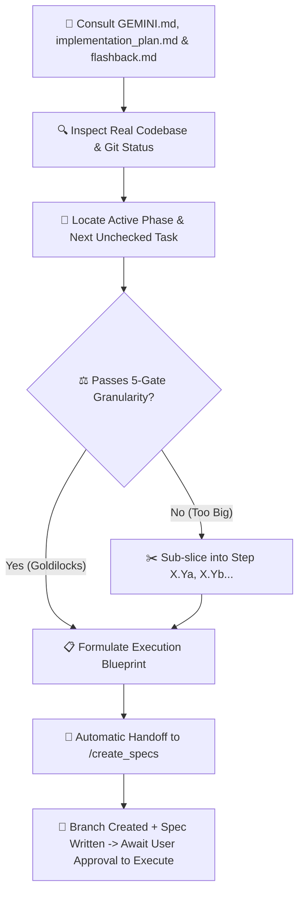

# 🎯 Next Step — Atomic Action Planner & Specification Handoff

`next_step` is the project's tactical pacing and alignment mechanism. It bridges the high-level roadmap in [`implementation_plan.md`](file:///d:/SIH%202026/implementation_plan.md) with the live project state in [`.agents/memory/flashback.md`](file:///d:/SIH%202026/.agents/memory/flashback.md) and the architectural invariants in [`GEMINI.md`](file:///d:/SIH%202026/GEMINI.md).

It strictly enforces the **5-Gate Goldilocks Task Granularity Standard**, guaranteeing that every step fits within the model's context window with **40–50% reserved headroom** for iterative edits, debugging, test runs, and code reviews before handing over to [`create_specs`](file:///d:/SIH%202026/.agents/skills/create_specs/SKILL.md).

---

## 🏛️ Mandatory Three-Pillar Context Consultation

Before formulating ANY next step, action plan, or verdict, `next_step` **MUST MANDATORILY READ AND CROSS-REFERENCE ALL THREE CORE FILES**:

1. 📖 [`GEMINI.md`](file:///d:/SIH%202026/GEMINI.md) — Master architecture, API contracts, PostGIS schemas, dynamic scoring algorithms, WebSocket event taxonomy, and system invariants.
2. 🗺️ [`implementation_plan.md`](file:///d:/SIH%202026/implementation_plan.md) — High-level phased master checklists, build order, dependencies, and exit criteria.
3. 🕰️ [`.agents/memory/flashback.md`](file:///d:/SIH%202026/.agents/memory/flashback.md) — Living memory ledger, Architecture Decision Records (ADRs), active phase status, and chronological changelog.

*Additionally, perform a quick scan of the actual workspace files to ensure the proposed task aligns with real repository state.*

---

## ⚖️ The 5-Gate Goldilocks Granularity Standard

To prevent context exhaustion and ensure maximum code quality, every step MUST pass all 5 gates before handoff:

```
┌────────────────────────────────────────────────────────────────────────┐
│ Context Window Breakdown (128k Token Standard Budget)                  │
├────────────────────────────────────────────────────────────────────────┤
│ Base Overhead (Prompts, Tools, References, System Invariants)  : ~53k  │
│ Target Step Code Generation (~150-300 LOC)                    : ~3k    │
│ Test Runner Execution & Stack Traces                           : ~4k    │
│ Iterative Debugging & Type-Fix Loops (1-2 turns)               : ~18k   │
│ Code Reviewer Evaluation & Diff Analysis                       : ~6k    │
├────────────────────────────────────────────────────────────────────────┤
│ PEAK TURN USAGE (Goldilocks Sized Step)                        : ~84k  │
│ RESERVED SAFETY HEADROOM (35–45% Buffer for Iterations)        : ~44k  │
└────────────────────────────────────────────────────────────────────────┘
```

### The 5 Gates Checklist:
1. **Target File Gate**: $\le 3$ target files total ($\le 2$ new files, $\le 1$ modified file).
2. **Code Volume Gate**: Total implementation logic is $\le 320$ LOC (excluding generated boilerplate).
3. **Single Architectural Concern**: Step addresses exactly ONE layer (e.g. Types + Service OR Service + Controller OR UI Component + Hook; never full-stack DB-to-UI in one turn).
4. **Verifiable Unit Gate**: Exactly 1 targeted test command to prove correctness (`npm test -- ...` or `pytest ...`).
5. **Headroom Assurance Gate**: Estimated turn consumption $\le 25,000$ tokens, ensuring $\ge 40\%$ context window headroom remains for debugging and reviewer feedback.

---

## ✂️ Automatic Sub-Slicing Rule

If a roadmap task in [`implementation_plan.md`](file:///d:/SIH%202026/implementation_plan.md) fails ANY of the 5 gates (e.g. Phase 4.9 SOS Module or Phase 2.2 Prisma Schema):
- **Do NOT attempt to execute the entire task at once.**
- Automatically slice it into alphabetical sub-steps: `Step X.Ya`, `Step X.Yb`, `Step X.Yc`.
- Package only the **first incomplete sub-step** and pass it to `create_specs`.
- Note the remaining sub-steps in the "Up Next in Queue" section.

---

## 🔄 Workflow & Operating Procedure



### Step 1: Consult Three Core Files & Codebase
- Read [`GEMINI.md`](file:///d:/SIH%202026/GEMINI.md) for target module contracts.
- Read [`implementation_plan.md`](file:///d:/SIH%202026/implementation_plan.md) to locate current unchecked task `[ ]`.
- Read [`.agents/memory/flashback.md`](file:///d:/SIH%202026/.agents/memory/flashback.md) for latest ADRs and milestones.
- Inspect workspace directories to check already implemented components.

### Step 2: Apply 5-Gate Sizing & Formulate Blueprint
Extract:
- `step_number`: e.g. `0.3a`, `1.1`, `2.2a`, `4.9a`
- `feature_title`: Human-readable title in Title Case (e.g. `SOS Spatial Matcher & SMS Gateway`)
- `feature_slug`: Kebab-cased slug (e.g. `step-4-9a-sos-matcher-sms`)
- `module`: Target module (`backend-spatial` | `ml-risk-engine` | `mobile-app` | `admin-dashboard` | `infra` | `cross-module`)
- `target_files`: List of $\le 3$ files to create/modify
- `objective`: 1-2 sentence statement of purpose
- `execution_checklist`: Specific atomic tasks
- `verification_criteria`: 1 targeted acceptance command and test

### Step 3: Automatic Handoff to `create_specs`
Immediately invoke or trigger `create_specs` with the formulated step metadata so that:
1. Working directory cleanliness is verified (`git status`).
2. Latest `main` is checked out and updated (`git checkout main && git pull origin main`).
3. Dedicated feature branch is created (`git checkout -b feat/<feature_slug>`).
4. Production-grade technical specification file is written to the appropriate `docs/` path.

---

## 📤 Standard Output Format

When responding to `/next_step`, present the recommendation and handoff in this exact structured format:

```markdown
### 🧭 Current Status Snapshot
- **Active Phase**: Phase X — [Phase Name]
- **Active Module**: `backend-spatial` | `ml-risk-engine` | `mobile-app` | `admin-dashboard` | `infra`
- **Consulted References**: `GEMINI.md` | `implementation_plan.md` | `flashback.md`
- **Last Completed**: [Brief mention of the most recently finished task/milestone]

---

### 🎯 Immediate Next Step: [Step ID] — [Step Title]
- **Scope**: Single Atomic Task (Goldilocks Calibrated: ~[X] LOC, [N] files)
- **Target Module**: [Module Name]
- **Target Files**:
  - `[NEW]` [path/to/file.ext](file:///d:/SIH%202026/path/to/file.ext)
  - `[MODIFY]` [path/to/file.ext](file:///d:/SIH%202026/path/to/file.ext)
- **Objective**: [1-2 sentences clearly describing what this specific step achieves]

#### 📋 Execution Checklist for this Step
1. [ ] [Specific sub-task 1, e.g. Define TypeScript types and Zod schemas]
2. [ ] [Specific sub-task 2, e.g. Implement service methods with error handling]
3. [ ] [Specific sub-task 3, e.g. Mount route in index.ts with auth guard]

#### 🧪 Verification & Acceptance Criteria
- [ ] [Single targeted test command, e.g. `npm test -- tests/auth.test.ts`]
- [ ] [Expected outcome or response shape]

---

### 🚀 Handoff to `create_specs`
*Proceeding to invoke `/create_specs` with:*
- **Step ID**: `[Step ID]`
- **Title**: `[Step Title]`
- **Slug**: `[feature-slug]`
- **Branch**: `feat/[feature-slug]`
- **Spec Path**: `[module]/docs/[feature-slug].md`

*(Calling `create_specs` to verify git status, branch off main, and generate the technical spec...)*
```
