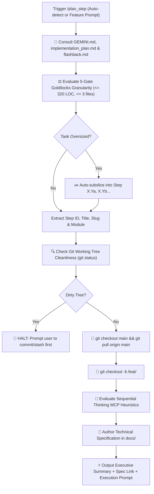

# 🚀 Plan Step — Automated Planning & Branch Provisioning Pipeline

`plan_step` is the automated front-end of the Safe Yatra development lifecycle. It eliminates manual planning and Git branch overhead by unifying **[`next_step`](file:///d:/SIH%202026/.agents/skills/next_step/SKILL.md)** and **[`create_specs`](file:///d:/SIH%202026/.agents/skills/create_specs/SKILL.md)** into a single, cohesive command.

---

## 🔄 End-to-End Pipeline Workflow



---

## 🔒 Automated Execution Stages

### Stage 1: Reference Ingestion & Task Sizing (`next_step`)
1. Mandatorily reads all three core project references:
   - 📖 [`GEMINI.md`](file:///d:/SIH%202026/GEMINI.md) — Master schemas, API contracts, PostGIS functions, risk formulas.
   - 🗺️ [`implementation_plan.md`](file:///d:/SIH%202026/implementation_plan.md) — Phased task checklists and milestones.
   - 🕰️ [`.agents/memory/flashback.md`](file:///d:/SIH%202026/.agents/memory/flashback.md) — Active phase, ADRs, and recent changelog.
2. Identifies the first incomplete task `[ ]` or processes the user's manual feature argument.
3. Evaluates the task against the **5-Gate Goldilocks Standard**:
   - $\le 3$ target files ($\le 2$ new, $\le 1$ modified).
   - $\le 320$ LOC of implementation/test logic.
   - Single architectural concern.
   - 1 targeted verification command.
   - $\ge 40\%$ context window headroom.
4. If oversized, automatically sub-slices into `Step X.Ya`, `Step X.Yb`, etc.

---

### Stage 2: Git Cleanliness & Branch Creation (`create_specs`)
1. Runs `git status -s`. If any uncommitted changes exist:
   - **HARD STOP**: Alerts developer to stash or commit changes. Halts execution.
2. Checks out latest `main` and pulls upstream:
   ```bash
   git checkout main
   git pull origin main
   ```
3. Checks existing branches (`git branch`) and creates the dedicated feature branch:
   ```bash
   git checkout -b feat/<feature-slug>
   ```

---

### Stage 3: Sequential Thinking MCP Evaluation & Spec Generation
1. Evaluates algorithmic, spatial, or state machine complexity:
   - ML Risk Scoring Formulas ($0.35 \times \text{weather} + 0.25 \times \text{crowd} + 0.20 \times \text{terrain} + 0.20 \times \text{history}$).
   - PostGIS Spatial Queries (`ST_DWithin`, `ST_Contains`, polygon geofencing).
   - SOS Emergency Transaction Chains & State Machines.
   - Offline SMS Bitmask Telemetry Encoding.
2. Determines destination path:
   - Cross-Module: `docs/specs/<feature-slug>.md`
   - Backend Spatial: `backend-spatial/docs/<feature-slug>.md`
   - ML Risk Engine: `ml-risk-engine/docs/<feature-slug>.md`
   - Mobile App: `mobile-app/docs/<feature-slug>.md`
   - Admin Dashboard: `admin-dashboard/docs/<feature-slug>.md`
3. Writes production-grade technical specification markdown file with data contracts, endpoints, implementation sequence, edge cases, and test criteria.

---

## 📤 Standard Output Format

```markdown
# 📋 /plan_step Complete — [Step ID: Feature Title]

### 🧭 Project Context
- **Active Phase**: Phase X — [Phase Name]
- **Target Module**: `[backend-spatial | ml-risk-engine | mobile-app | admin-dashboard | infra]`
- **Granularity Sizing**: Goldilocks Verified (~[X] LOC, [N] files, ~45% context headroom reserved)

---

### 🌿 Git Feature Branch
`feat/[feature-slug]` *(Checked out and synchronized from origin/main)*

---

### 📁 Technical Specification Created
- [path/to/spec.md](file:///d:/SIH%202026/path/to/spec.md)

---

### 🧠 Sequential Thinking MCP Recommendation
*(Appears only if task meets high complexity heuristics)*
> 🧠 **Recommendation**: Use Sequential Thinking MCP for multi-stage reasoning on **[Complex Area]** (`Approved` / `Skipped`).

---

### ⚡ Ready to Implement?
The specification is locked and the branch is clean. Would you like me to begin implementing this feature now?
```

---

## 🚀 Triggers

- `/plan_step` (Auto-locates next unchecked step from `implementation_plan.md`)
- `/plan_step [step-number] [feature-name]`
- `"Plan next step and create branch"`
- `"Start next feature"`
