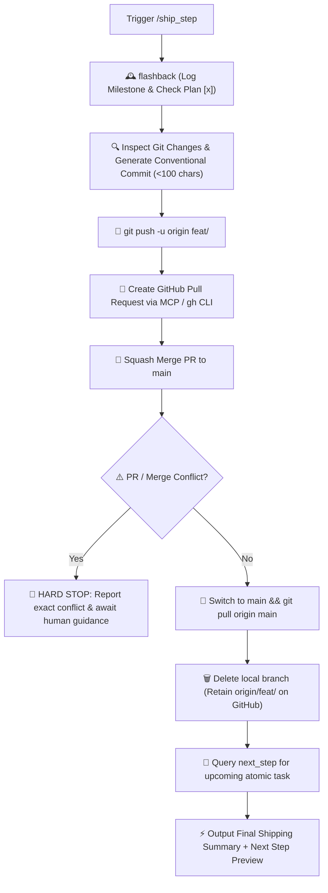

# 🚀 Ship Step — Memory Sync, Git PR & Transition Pipeline

`ship_step` is the automated release and synchronization engine for Safe Yatra. It takes verified, high-quality code, logs the achievement in the project's living memory ledger ([`flashback.md`](file:///d:/SIH%202026/.agents/memory/flashback.md)), checks off the roadmap milestone in [`implementation_plan.md`](file:///d:/SIH%202026/implementation_plan.md), executes the complete Git & GitHub PR squash-merge lifecycle, and pre-fetches the next atomic task.

---

## 🔄 End-to-End Pipeline Workflow



---

## 🔒 Automated Execution Stages

### Stage 1: Living Memory & Plan Synchronization (`flashback`)
1. Appends a chronological entry in [`.agents/memory/flashback.md`](file:///d:/SIH%202026/.agents/memory/flashback.md) under **Section 4: Chronological Activity Log**:
   - Module impacted (`backend-spatial` | `ml-risk-engine` | `mobile-app` | `admin-dashboard` | `infra`).
   - Summary of changes, new components, and tests added.
   - List of key files created/modified.
2. Updates checkboxes `[x]` in [`implementation_plan.md`](file:///d:/SIH%202026/implementation_plan.md) for completed tasks.
3. If an architectural decision was established during the feature, records an ADR in `flashback.md`.

---

### Stage 2: Git Commit, Push & GitHub PR Lifecycle (`update-github`)
1. **Identify Branch**: Confirms current feature branch name (`CURRENT_BRANCH`).
2. **Conventional Commit Message Generation**:
   - Prefix: `feat:`, `fix:`, `chore:`, `refactor:`, `test:`, `docs:`
   - Format: Lowercase, no trailing period.
   - **Length Constraint**: **Strictly under 100 characters**.
3. **Stage & Commit**:
   ```bash
   git add .
   git commit -m "<conventional-message>"
   ```
4. **Push Upstream**:
   ```bash
   git push -u origin CURRENT_BRANCH
   ```
5. **Create & Squash Merge PR**:
   - Creates Pull Request into `main` via GitHub MCP / `gh pr create`.
   - Executes **Squash Merge** into `main` via GitHub MCP / `gh pr merge --squash`.
   - **Hard Stop Gate**: If PR creation or merge fails (e.g. merge conflicts, branch protection violations), **HALT IMMEDIATELY** and notify user without touching local branches.
6. **Local Cleanup & Remote Retention**:
   - Switches to `main`: `git checkout main && git pull origin main`.
   - Deletes local branch: `git branch -D CURRENT_BRANCH`.
   - **Rule**: **Preserves `origin/CURRENT_BRANCH` on GitHub** for revision history and audit trails.

---

### Stage 3: Next Atomic Task Query (`next_step`)
1. Immediately queries [`next_step`](file:///d:/SIH%202026/.agents/skills/next_step/SKILL.md) to inspect the updated plan and memory ledger.
2. Prepares the next atomic, Goldilocks-sized task in queue.

---

## 📤 Standard Output Format

```markdown
# 🚢 /ship_step Complete — [Feature Title]

### 📦 GitHub PR & Merge Summary
- **Commit**: `<type>: <description>` *(Under 100 characters)*
- **Pull Request**: `PR #<NUMBER> — <PR Title>`
- **Merge Strategy**: `Squash & Merge` ➔ `main` (Up to date)
- **Branch Status**:
  - `✓` Remote branch preserved on GitHub: `origin/feat/<feature-slug>`
  - `✓` Local feature branch cleaned up: `feat/<feature-slug>`

---

### 🕰️ Memory Ledger Synchronized
- **Flashback Log**: [`.agents/memory/flashback.md`](file:///d:/SIH%202026/.agents/memory/flashback.md) updated.
- **Roadmap Checklist**: [`implementation_plan.md`](file:///d:/SIH%202026/implementation_plan.md) marked `[x]` for completed step.

---

### ⏭️ Up Next in Queue
*The next atomic task in the Safe Yatra roadmap is:*
> **[Step ID] — [Next Step Title]** (`[Module Name]`)  
> *Objective: [1-sentence description of what comes next]*

---

### ⚡ Ready to Continue?
Would you like me to trigger `/plan_step` for **[Next Step ID: Next Step Title]**?
```

---

## 🚀 Triggers

- `/ship_step`
- `"Ship current feature and merge to main"`
- `"Merge PR and update memory"`
- `"Complete step and update github"`
