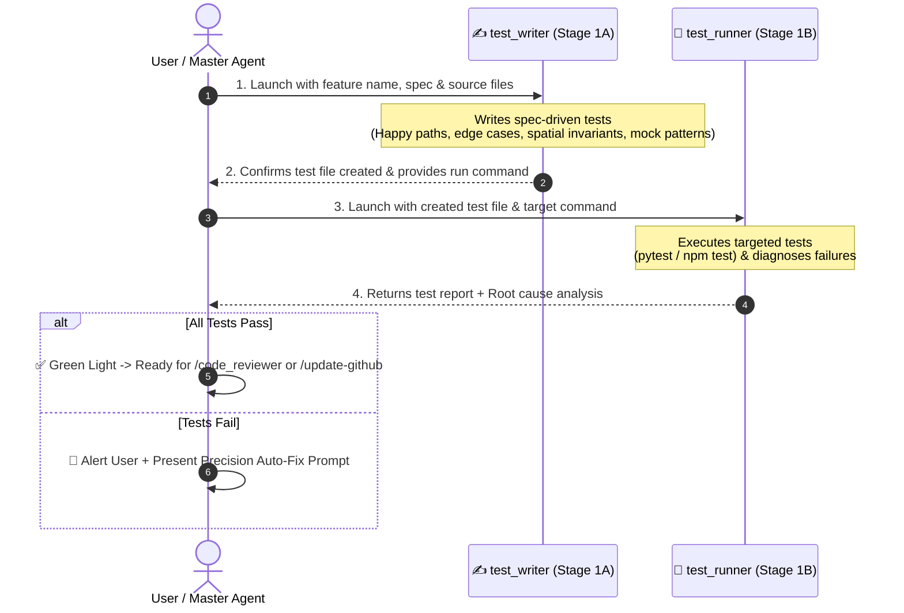

# 🧪 Test Runner — Two-Stage Test Authoring & Execution Pipeline

`test_runner` is an automated testing workflow designed to guarantee behavioral correctness and prevent regressions across the Safe Yatra ecosystem. It enforces a strict **two-stage sequential pipeline** where test authoring ([`test_writer`](file:///d:/SIH%202026/.agents/skills/test_writer/SKILL.md)) is decoupled from test execution, diagnosis, and root-cause analysis (`test_runner`).

---

## 🎯 Architecture: Two-Stage Sequential Pipeline



---

## 🔒 Strict Handoff & Safety Rules

1. **Strict Sequential Execution**: `test_runner` must NEVER start until `test_writer` has fully completed writing the test file and verified its syntax and imports.
2. **Targeted Execution**: Run ONLY the test file authored for the target feature. Do not run unrelated full test suites unless running monorepo smoke checks (`make test-all`) or full coverage verification.
3. **Zero In-Flight Code Mutation**: Neither subagent is permitted to alter application source code during the testing pipeline. They report findings and provide an actionable fix prompt.
4. **Spec-Driven Over Implementation-Driven**: `test_writer` writes tests based on what the specifications in [`GEMINI.md`](file:///d:/SIH%202026/GEMINI.md), [`implementation_plan.md`](file:///d:/SIH%202026/implementation_plan.md), and module `docs/` require, not merely copying existing implementation quirks.
5. **Spatial Coordinate Invariant Testing Rule**: Always assert coordinate ordering explicitly:
   - **Mobile / REST / GPS UI**: `[latitude, longitude]` or `{ lat, lng }`
   - **GeoJSON / PostGIS / Turf.js / WKT**: `[longitude, latitude]` (e.g., `ST_MakePoint(lng, lat)` / `ST_SetSRID(ST_Point(lng, lat), 4326)`)
   - Tests MUST assert that spatial converters correctly transform between client `(lat, lng)` and GIS `(lng, lat)` without inverted-axis regressions.
6. **Coverage Threshold Invariant**:
   - Line coverage: $\ge 80\%$
   - Branch coverage: $\ge 70\%$
   - Public API endpoints: $100\%$ route coverage
7. **Timeout & Execution Guardrails**:
   - Stage 1A (`test_writer` authoring): Max 120s wall-clock time limit.
   - Stage 1B (`test_runner` execution): Max 60s per test file execution limit.

---

## 🛠️ Module Test Commands & CI Alignment

All test execution commands are aligned with the monorepo CI workflow ([`.github/workflows/ci.yml`](file:///d:/SIH%202026/.github/workflows/ci.yml)) and module `package.json` scripts:

| Module                | Framework                                    | Test Directory               | Targeted Execution Command              | Full Suite & Coverage Command                        |
| :-------------------- | :------------------------------------------- | :--------------------------- | :-------------------------------------- | :--------------------------------------------------- |
| **`backend-spatial`** | `jest` / `ts-jest` + `supertest`             | `backend-spatial/tests/`     | `npm test -- tests/<file>.test.ts`      | `npm run test:coverage` _(or `npx jest --coverage`)_ |
| **`ml-risk-engine`**  | `pytest`                                     | `ml-risk-engine/tests/`      | `pytest tests/test_<file>.py -v`        | `pytest --cov=app --cov-report=term-missing tests/`  |
| **`mobile-app`**      | `jest` + `@testing-library/react-native`     | `mobile-app/__tests__/`      | `npm test -- __tests__/<file>.test.tsx` | `npm test -- --coverage`                             |
| **`admin-dashboard`** | `vitest` / `jest` + `@testing-library/react` | `admin-dashboard/__tests__/` | `npm test -- __tests__/<file>.test.tsx` | `npm run test:coverage --if-present`                 |

> [!NOTE]
> **Command Clarification**:
>
> - `npm test` in `backend-spatial` resolves to `jest --passWithNoTests`. Passing `-- tests/<file>.test.ts` executes only the targeted test file without overhead.
> - `npm run test:coverage` executes the full suite with Istanbul coverage reporting to verify the $\ge 80\%$ line and $\ge 70\%$ branch thresholds.

---

## 🔍 CI Pipeline Integration Awareness

Safe Yatra runs automated CI on every push to `main` and `feat/**` branches. To prevent local vs CI drift:

1. Ensure test commands run in the proper working directory (`backend-spatial/`, `ml-risk-engine/`, etc.).
2. Test commands must not assume pre-existing database connections or live external API keys (tests must be 100% hermetic with mocked Prisma/Redis/APIs).
3. Verify test commands match the CI workflow configuration:
   ```bash
   # Verify CI test step definitions
   grep -A5 "Run Tests" .github/workflows/ci.yml
   ```

---

## 🏷️ Expanded Failure Classification Taxonomy

When test assertions fail, classify the failure using this real-world taxonomy:

| Failure Type         | Root Cause Indicator                                                             | Typical Solution                                                                                                                                                |
| :------------------- | :------------------------------------------------------------------------------- | :-------------------------------------------------------------------------------------------------------------------------------------------------------------- |
| `PRISMA_MOCK_SHAPE`  | `TypeError: prisma.model.method is not a function` or mock return value mismatch | Match Prisma model accessor casing (`prisma.sOSEvent`, `prisma.volunteerProfile`) and mock method (`findUnique`, `findFirst`, `create`, `update`, `$queryRaw`). |
| `ENUM_MISMATCH`      | `Expected 'CRITICAL', Received 'HIGH'` or Prisma enum string mismatch            | Cross-reference enum definitions in `schema.prisma` (`SOSTier`, `UserRole`, `SOSStatus`) or `response.py` (`DangerTier`).                                       |
| `ASYNC_UNHANDLED`    | `UnhandledPromiseRejection` or test timeout                                      | Ensure `await` is present on all async service/database calls and express request promises.                                                                     |
| `REDIS_MOCK_MISSING` | `redis.get` / `redis.set` returning undefined during cache branches              | Configure `(redis.get as jest.Mock).mockResolvedValue(null)` or cached JSON string for hit/miss branches.                                                       |
| `SOCKET_ROOM_ERROR`  | Socket event listener not firing or room message not received                    | Verify Socket.IO server setup, client `auth.token`, room prefix (`zone:{id}`, `user:{id}`, `role:{role}`), and `done()` callback in test.                       |
| `SPATIAL_ERROR`      | Coordinate axis inversion or `ST_DWithin` units in degrees instead of meters     | Ensure PostGIS queries cast to `::geography` and client `[lat, lng]` maps to PostGIS `[lng, lat]`.                                                              |
| `TYPE_ERROR`         | TypeScript compilation or Python type annotation mismatch                        | Run `npx tsc --noEmit` or `ruff check .` and fix missing type exports.                                                                                          |
| `ASSERTION_FAIL`     | Expected value does not equal actual returned value                              | Business logic bug in service layer or incorrect test expectation.                                                                                              |
| `IMPORT_ERROR`       | Module not found or export syntax mismatch                                       | Correct import path (e.g. `import { app } from '../src/index'`).                                                                                                |
| `TIMEOUT`            | Async operation exceeded Jest/pytest timeout limit                               | Check for unresolved promises, missing timer advances, or infinite loops.                                                                                       |

---

## 🔄 Flaky Test Handling & Diagnostics

For asynchronous tests (WebSockets, background jobs, timer intervals):

1. **Detection**: If a test fails once but passes on an immediate second run without code changes, flag it as **FLAKY**.
2. **Diagnosis**: Run with `--forceExit --detectOpenHandles` to check for unclosed server connections, database handles, or active intervals:
   ```bash
   npx jest tests/<file>.test.ts --verbose --forceExit --detectOpenHandles
   ```
3. **Remediation**:
   - For Jest async tests: add `jest.retryTimes(2, { logErrorsBeforeRetry: true })`.
   - For fake timers: ensure `jest.useFakeTimers()` is paired with `jest.useRealTimers()` in `afterEach()`.
   - For WebSockets: ensure `clientSocket.disconnect()` and `closeSocketServer()` are called in `afterAll()`.

---

## ⚡ Performance & Execution Tuning

For fast local developer feedback vs thorough CI verification:

```bash
# Fast parallel targeted execution (default)
npm test -- tests/<target>.test.ts

# Full test suite with coverage report
npm run test:coverage

# Sequential debug execution (isolates concurrency/port conflicts)
npx jest --runInBand --verbose

# Memory-constrained execution (matches CI runner)
npx jest --maxWorkers=2

# Full monorepo smoke test (all modules)
make test-all
```

---

## 📋 Execution Procedure

### Step 1 — Authoring Tests ([`test_writer`](file:///d:/SIH%202026/.agents/skills/test_writer/SKILL.md))

Invoke `test_writer` with:

- **Feature / Target**: e.g., `backend-spatial/step-4-11b-geofence-job`
- **Spec References**: Module spec path (e.g. `backend-spatial/docs/step-4-11b-geofence-job.md`)
- **Output Target**: e.g. `backend-spatial/tests/jobs.geofence.test.ts`
- **Requirements to Cover**:
  - Happy paths & standard operations
  - Boundary limits & extreme values
  - PostGIS coordinate ordering invariants (`(lat, lng)` vs `(lng, lat)`)
  - API response envelopes (`ok()` / `fail()`)
  - Error recovery & timeout fallbacks

_Wait for `test_writer` to finish before proceeding._

---

### Step 2 — Running & Diagnosing Tests (`test_runner`)

Invoke `test_runner` with:

- **Test File Path**: Path generated by `test_writer`.
- **Execution Command**: `npm test -- tests/<file>.test.ts` or `pytest tests/test_<file>.py -v`
- **Context Source Files**: Implementation files to inspect if failures occur.

---

## 📤 Standard Report Output Format

````markdown
# 🧪 Testing Pipeline Report — [Feature Name]

### ✍️ Step 1 — Tests Authored (test_writer)

- **Target File**: `[tests/test_feature.ts](file:///d:/SIH%202026/backend-spatial/tests/test_feature.ts)`
- **Key Test Cases Covered**:
  - `test_standard_flow`: Validates successful calculation under normal conditions.
  - `test_boundary_conditions`: Asserts behavior when inputs hit upper/lower bounds.
  - `test_spatial_coordinate_order`: Asserts client (lat, lng) correctly maps to PostGIS (lng, lat).
  - `test_service_fallback`: Verifies fallback to cache when external API returns 500.

---

### 🏃 Step 2 — Execution Results (test_runner)

- **Command Executed**: `npm test -- tests/test_feature.test.ts`
- **Results**: `6 passed, 0 failed` (or `5 passed, 1 failed`)
- **Coverage**: `Line: 88%, Branch: 76%, Routes: 100%`

---

### 🚨 Failure Analysis & Root Cause (Only if tests fail)

#### Failure: `test_service_fallback`

- **Classification**: `REDIS_MOCK_MISSING` / `ASSERTION_FAIL`
- **Location in Code**: `[src/modules/danger/danger.service.ts:48](file:///d:/SIH%202026/backend-spatial/src/modules/danger/danger.service.ts#L48)`
- **Expected**: Return cached score object when ML microservice times out.
- **Actual**: Threw unhandled `AbortError`.
- **Root Cause**: Missing fallback catch handler wrapping the external `fetch()` call.

---

### 🚦 Verdict

- [ ] ✅ **Ready for Code Review**: All tests passed without issues.
- [ ] ❌ **Needs Fixes**: See the curated fix prompt below.

---

### ⚡ Curated Auto-Fix Prompt (If tests failed)

> ```text
> Fix the failing tests in [Feature Name]:
> 1. In [src/modules/danger/danger.service.ts:L48], wrap the fetch call in a try/catch block for AbortError and return cached danger score.
> 2. Re-run `npm test -- tests/danger.service.test.ts` to confirm all assertions pass.
> ```
````

---

## 🚀 Triggers

- `/test_runner [feature-name]`
- `/test-feature [feature-name]`
- `"Run tests for danger score module"`
- `"Write and run tests for backend auth"`
