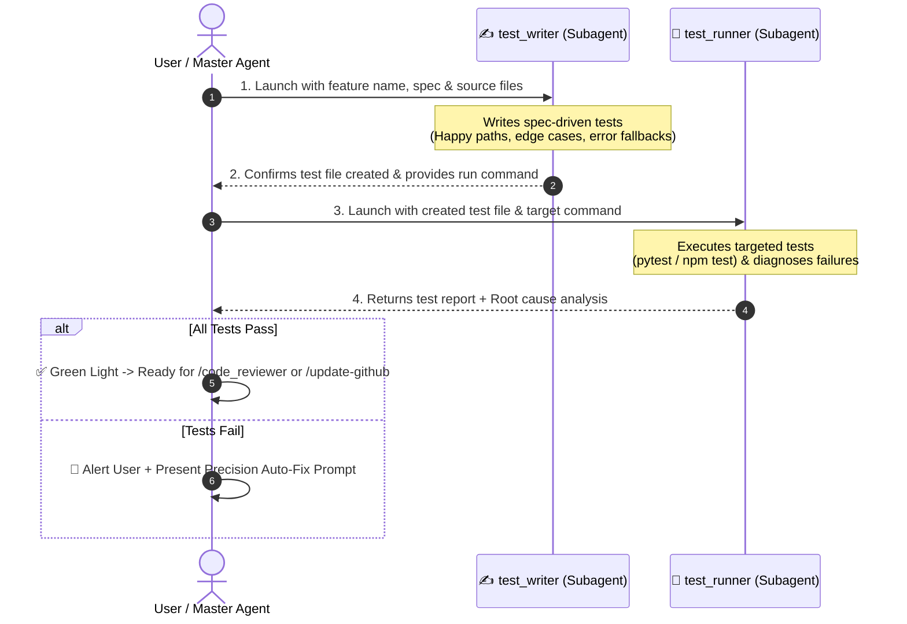

# 🧪 Test Runner — Two-Stage Test Authoring & Execution Pipeline

`test_runner` is an automated testing workflow designed to guarantee behavioral correctness and prevent regressions across the Safe Yatra ecosystem. It enforces a strict **two-stage sequential pipeline** where test authoring is decoupled from test execution and diagnosis.

---

## 🎯 Architecture: Two-Stage Sequential Pipeline



---

## 🔒 Strict Handoff & Safety Rules

1. **Strict Sequential Execution**: `test_runner` must NEVER start until `test_writer` has fully completed writing the test file and verified its syntax.
2. **Targeted Execution**: Run ONLY the test file authored for the target feature. Do not run unrelated full test suites to conserve time and isolate failures.
3. **Zero In-Flight Code Mutation**: Neither subagent is permitted to alter application source code during the testing pipeline. They report findings and provide an actionable fix prompt.
4. **Spec-Driven Over Implementation-Driven**: `test_writer` writes tests based on what the specifications in [`GEMINI.md`](file:///d:/SIH%202026/GEMINI.md) and [`implementation_plan.md`](file:///d:/SIH%202026/implementation_plan.md) require, not merely copying existing implementation quirks.
5. **Spatial Coordinate Invariant Testing Rule**: Always assert coordinate ordering explicitly:
   - **Mobile / REST / GPS UI**: `[latitude, longitude]` or `{ lat, lng }`
   - **GeoJSON / PostGIS / Turf.js**: `[longitude, latitude]` (e.g., `ST_MakePoint(lng, lat)` / `ST_SetSRID(ST_Point(lng, lat), 4326)`)
   - Tests MUST assert that spatial converters and adapters correctly transform between client `(lat, lng)` and GIS `(lng, lat)` without inverted-axis regressions.

---

## 🛠️ Module Test Commands & Conventions

| Module | Framework | Test Directory | Run Command Example |
| :--- | :--- | :--- | :--- |
| **`ml-risk-engine`** | `pytest` + `pytest-asyncio` | `ml-risk-engine/tests/` | `pytest tests/test_danger_score.py -v` |
| **`backend-spatial`** | `jest` / `vitest` + `supertest` | `backend-spatial/tests/` | `npm test -- tests/auth.test.ts` |
| **`mobile-app`** | `jest` + React Native Testing Library | `mobile-app/__tests__/` | `npm test -- __tests__/SOSButton.test.tsx` |
| **`admin-dashboard`** | `vitest` / `jest` | `admin-dashboard/__tests__/` | `npm test -- __tests__/Heatmap.test.tsx` |

---

## 🧰 Multi-Framework Testing & Mocking Catalog

To guarantee reliable, hermetic test execution across all four decoupled modules, `test_writer` and `test_runner` must adopt the standardized testing and mocking fixtures:

### 1. Python / FastAPI (`ml-risk-engine`)
- **Async Test Harness**: Use `pytest-asyncio` with `@pytest.mark.asyncio`.
- **In-Memory ASGI Client**: Use `httpx.AsyncClient(transport=ASGITransport(app=app), base_url="http://test")` for zero-port HTTP integration tests.
- **External API Mocking**: Use `respx` to intercept and mock third-party meteorological and topographical calls:
  - Mock OpenWeatherMap (`https://api.openweathermap.org/data/2.5/weather`) for rainfall, wind, and forecast conditions.
  - Mock OpenTopoData / SRTM endpoints for elevation and slope queries.
  - Assert graceful fallback behavior when `respx` simulates HTTP 500 or timeout exceptions (`httpx.TimeoutException`).

### 2. Node.js / Express / PostGIS (`backend-spatial`)
- **HTTP Endpoint Assertions**: Use `supertest` for REST API route and middleware validation (JWT auth, role guards, Zod error envelopes).
- **Redis Mocking**: Use `ioredis-mock` to mock Redis caching, token blacklists, and Pub/Sub channels without requiring a running Redis daemon.
- **WebSocket Event Testing**: Use `socket.io-client` test client connected to the HTTP server instance to test real-time room joining and broadcast events (`zone:{id}`, `sos:{id}`, `admin`).
- **PostGIS Spatial Mock Fixtures**: Provide deterministic geo-fixtures for spatial queries (`ST_DWithin`, `ST_Contains`, `ST_Centroid`) and verify distance calculations with spherical meters.

### 3. React Native / Expo (`mobile-app`)
- **Native Module Mocking**: Configure Jest with comprehensive mocks to prevent native TurboModule crashes in headless Node environments:
  - `expo-location`: Mock `requestForegroundPermissionsAsync`, `requestBackgroundPermissionsAsync`, `getCurrentPositionAsync`, and `watchPositionAsync` with mock GPS coordinate streams.
  - `expo-av`: Mock `Audio.Recording` lifecycle (`prepareToRecordAsync`, `startAsync`, `stopAndUnloadAsync`, `getURI`).
  - `expo-sms`: Mock `SMS.isAvailableAsync` and `SMS.sendSMSAsync` for offline SOS fallback verification.
  - `expo-notifications`: Mock `scheduleNotificationAsync` and push token retrieval.
  - `react-native-maps`: Mock `MapView`, `Polygon`, `Marker`, and `Circle` components to render testable tree representations without native map tiles.

### 4. Next.js 14 / App Router (`admin-dashboard`)
- **Map & Canvas Mocks**: Mock Mapbox GL JS (`mapboxgl.Map`) and Leaflet (`L.map`) canvas/WebGL contexts to prevent headless JSDOM rendering errors.
- **TanStack Query Wrapper**: Wrap test components in a test `QueryClientProvider` instantiated with `{ defaultOptions: { queries: { retry: false, gcTime: 0 } } }` to eliminate unhandled asynchronous state polling.

---

## 📋 Execution Procedure

### Step 1 — Authoring Tests (`test_writer`)
Invoke `test_writer` with:
- **Feature / Target**: e.g., `ml-risk-engine/danger_score` or `backend-spatial/auth`
- **Spec References**: [`GEMINI.md`](file:///d:/SIH%202026/GEMINI.md) section and [`implementation_plan.md`](file:///d:/SIH%202026/implementation_plan.md) task ID.
- **Output Target**: e.g. `ml-risk-engine/tests/test_danger_score.py`
- **Requirements to Cover**:
  - Valid standard inputs (Happy paths)
  - Edge cases (Extreme coordinates, zero values, boundary limits)
  - Validation failures (Missing fields, invalid data types)
  - Spatial coordinate format invariants (`[lat, lng]` client vs `[lng, lat]` GIS)
  - External API error handling (Weather API timeout fallback)
  - Authentication/Authorization guards (401/403 responses)

*Wait for `test_writer` to finish before proceeding.*

---

### Step 2 — Running & Diagnosing Tests (`test_runner`)
Invoke `test_runner` with:
- **Test File Path**: Path generated by `test_writer`.
- **Execution Command**: `pytest ...` or `npm test -- ...`
- **Context Source Files**: The underlying implementation files to cross-examine if an assertion fails.

---

## 📤 Standard Report Output Format

```markdown
# 🧪 Testing Pipeline Report — [Feature Name]

### ✍️ Step 1 — Tests Authored
- **Target File**: `[tests/test_feature.py](file:///d:/SIH%202026/tests/test_feature.py)`
- **Key Test Cases Covered**:
  - `test_standard_flow`: Validates successful calculation under normal conditions.
  - `test_boundary_conditions`: Asserts behavior when inputs hit upper/lower bounds.
  - `test_spatial_coordinate_order`: Asserts client (lat, lng) correctly maps to PostGIS (lng, lat).
  - `test_service_fallback`: Verifies fallback to cache when external API returns 500.

---

### 🏃 Step 2 — Execution Results
- **Command Executed**: `pytest tests/test_feature.py -v`
- **Results**: `5 passed, 1 failed` (or `6 passed, 0 failed`)

---

### 🚨 Failure Analysis & Root Cause (Only if tests fail)
#### Failure: `test_service_fallback`
- **Location in Code**: `[services/weather_service.py:48](file:///d:/SIH%202026/ml-risk-engine/app/services/weather_service.py#L48)`
- **Expected**: Return cached score object when API times out.
- **Actual**: Threw unhandled `httpx.ConnectTimeout` error.
- **Root Cause**: Missing `try...except httpx.TimeoutException` block wrapping the HTTP client call.

---

### 🚦 Verdict
- [ ] ✅ **Ready for Code Review**: All tests passed without issues.
- [ ] ❌ **Needs Fixes**: See the curated fix prompt below.

---

### ⚡ Curated Auto-Fix Prompt (If tests failed)
> ```text
> Fix the failing tests in [Feature Name]:
> 1. In [weather_service.py:L48], wrap the httpx GET call in a try/except block for httpx.TimeoutException and return cached_weather_score.
> 2. Re-run `pytest tests/test_weather_service.py` to confirm all assertions pass.
> ```
```

---

## 🚀 Triggers

- `/test_runner [feature-name]`
- `/test-feature [feature-name]`
- `"Run tests for danger score module"`
- `"Write and run tests for backend auth"`
