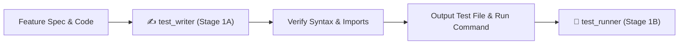

# ✍️ Test Writer — Spec-Driven Test Authoring Engine

`test_writer` is the dedicated test authoring subagent and skill for Safe Yatra. It synthesizes robust, spec-driven unit and integration tests based on technical specifications in [`GEMINI.md`](file:///d:/SIH%202026/GEMINI.md), [`implementation_plan.md`](file:///d:/SIH%202026/implementation_plan.md), and `docs/specs/`.

---

## 🎯 Architecture: Role & Decoupled Execution

`test_writer` operates strictly in **Stage 1A** of the verification pipeline:
1. It receives the target feature name, specification path, and implemented source code.
2. It writes comprehensive, non-tautological tests covering happy paths, edge cases, spatial invariants, API response envelopes, and error handling.
3. It validates syntax and imports before handing off to **`test_runner`** (Stage 1B) for execution.



---

## 🔒 Non-Negotiable Invariants & Principles

1. **Spec-Driven Over Implementation-Driven**:
   - Write tests based on what the specification requires, NOT by copying implementation bugs or quirks.
   - Never write trivial/tautological tests that assert `true === true` or test internal private state directly.

2. **Spatial Coordinate Invariant Testing Rule**:
   - **Mobile / REST / GPS UI**: `[latitude, longitude]` or `{ lat, lng }` (lat $\approx 18.75$, lng $\approx 73.40$).
   - **GeoJSON / PostGIS / Turf.js / WKT**: `[longitude, latitude]` (e.g., `ST_MakePoint(lng, lat)` / `ST_SetSRID(ST_Point(lng, lat), 4326)` / `POINT(73.4062 18.7546)`).
   - Tests **MUST explicitly assert** that coordinate transformations map correctly between client `(lat, lng)` and PostGIS `(lng, lat)` without inverted-axis regressions.

3. **API Response Envelope & Status Invariants**:
   - Success responses must assert `body.success === true`, `body.data !== null`, `body.error === null`.
   - Error responses must assert `body.success === false`, `body.data === null`, `body.error.code` & `body.error.message` defined.
   - Assert standard HTTP statuses: `200 OK`, `201 Created`, `400 Bad Request` (Zod error), `401 Unauthorized`, `403 Forbidden`, `404 Not Found`.

4. **Coverage Threshold Requirements**:
   - Line coverage: $\ge 80\%$
   - Branch coverage: $\ge 70\%$
   - Public API endpoints / routes: $100\%$ route coverage

5. **Hermetic & Isolated**:
   - Tests must NOT depend on live external networks (OpenWeather, Mapbox, Twilio) or unseeded databases.
   - Use in-memory mocks and fixtures provided in the Multi-Framework Testing Catalog.

6. **Timeout & Budget Guardrail**:
   - Authoring budget: Maximum 120s wall-clock synthesis time.

---

## 🧰 Per-Module Test Fixture & Mocking Patterns

### 1. Python / FastAPI (`ml-risk-engine`)
- **Framework**: `pytest`, `pytest-asyncio`, `respx`, `httpx`
- **Target Dir**: `ml-risk-engine/tests/`
- **File Pattern**: `test_<feature_slug>.py`
- **Template**:
```python
import pytest
import respx
from httpx import AsyncClient, ASGITransport
from app.main import app

@pytest.mark.asyncio
async def test_danger_score_calculation():
    async with AsyncClient(transport=ASGITransport(app=app), base_url="http://test") as client:
        response = await client.post("/api/v1/score", json={"lat": 18.7546, "lng": 73.4062})
        assert response.status_code == 200
        data = response.json()
        assert "danger_score" in data
        assert 0 <= data["danger_score"] <= 100
        assert "factors" in data

@pytest.mark.asyncio
@respx.mock
async def test_weather_service_fallback_on_timeout():
    respx.get("https://api.openweathermap.org/data/2.5/weather").mock(
        side_effect=Exception("Connection Timeout")
    )
    async with AsyncClient(transport=ASGITransport(app=app), base_url="http://test") as client:
        response = await client.post("/api/v1/score", json={"lat": 18.7546, "lng": 73.4062})
        assert response.status_code == 200
        assert response.json()["danger_score"] is not None
```

### 2. Node.js / Express / PostGIS (`backend-spatial`)
- **Framework**: `jest` / `ts-jest`, `supertest`, `ioredis-mock`
- **Target Dir**: `backend-spatial/tests/`
- **File Pattern**: `<feature_slug>.test.ts`
- **Template**:
```typescript
import request from 'supertest';
import { app } from '../src/app';

describe('Spatial & Auth API Endpoints', () => {
  it('should enforce [lat, lng] to PostGIS [lng, lat] coordinate conversion', async () => {
    const payload = { latitude: 18.7546, longitude: 73.4062 };
    const res = await request(app)
      .post('/api/v1/danger/score')
      .send(payload);

    expect(res.status).toBe(200);
    expect(res.body.success).toBe(true);
    expect(res.body.data.coordinates).toEqual({ lat: 18.7546, lng: 73.4062 });
  });

  it('should reject unauthenticated requests with 401 fail envelope', async () => {
    const res = await request(app).get('/api/v1/auth/me');
    expect(res.status).toBe(401);
    expect(res.body.success).toBe(false);
    expect(res.body.error).toBeDefined();
  });
});
```

### 3. React Native / Expo (`mobile-app`)
- **Framework**: `jest`, `@testing-library/react-native`
- **Target Dir**: `mobile-app/__tests__/`
- **File Pattern**: `<ComponentName>.test.tsx`
- **Mocks**: `expo-location`, `expo-av`, `expo-sms`, `react-native-maps`

### 4. Next.js 14 / App Router (`admin-dashboard`)
- **Framework**: `vitest` / `jest`, `@testing-library/react`
- **Target Dir**: `admin-dashboard/__tests__/`
- **File Pattern**: `<ComponentName>.test.tsx`
- **Mocks**: Mapbox GL / Leaflet canvas contexts, `QueryClientProvider` with `{ defaultOptions: { queries: { retry: false, gcTime: 0 } } }`

---

## 📋 Input & Output Contract

### Input Contract:
- `feature_name`: e.g. `offline-sos-sms-fallback`
- `module_target`: `backend-spatial` | `ml-risk-engine` | `mobile-app` | `admin-dashboard`
- `spec_path`: Path to feature specification markdown
- `source_files`: Array of implemented source files

### Output Contract:
- `test_file_path`: Absolute or relative path to the generated test file
- `run_command`: Exact command line to execute the authored test file (e.g. `npm test -- tests/auth.test.ts`)
- `test_count`: Total number of test assertions written
- `coverage_categories`: List of covered areas (Happy paths, Edge cases, Spatial order, API envelopes, Error fallbacks, Auth)

---

## 🚨 Error Recovery Protocol

If syntax, import, or type errors are encountered during test authoring:
1. Inspect the module's `package.json` / `requirements.txt` to confirm installed testing packages and types.
2. Check `tsconfig.json` paths and TypeScript interfaces for exact property names.
3. Fix all import/syntax issues BEFORE reporting test authoring complete.
4. Never pass a syntactically invalid test file to `test_runner`.

---

## 🚀 Triggers

- Automatic invocation from `/verify_step` (Stage 1A)
- Automatic invocation from `/test_runner` (Step 1)
- Manual command: `/test_writer [feature-name]`
