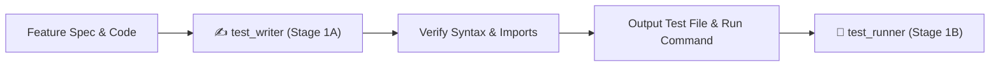

# ✍️ Test Writer — Spec-Driven Test Authoring Engine

`test_writer` is the dedicated test authoring subagent and skill for Safe Yatra. It synthesizes robust, spec-driven unit and integration tests based on technical specifications in [`GEMINI.md`](file:///d:/SIH%202026/GEMINI.md), [`implementation_plan.md`](file:///d:/SIH%202026/implementation_plan.md), and module-specific specification files.

---

## 🎯 Architecture: Role & Decoupled Execution

`test_writer` operates strictly in **Stage 1A** of the verification pipeline:

1. It receives the target feature name, specification path, and implemented source code.
2. It writes comprehensive, non-tautological tests covering happy paths, edge cases, spatial invariants, API response envelopes, and error handling.
3. It validates syntax and imports before handing off to **`test_runner`** (Stage 1B) for execution.



---

## 📁 Specification Destination Paths

When referencing or reading specifications, use the established module-specific directory layout:

| Scope                            | Specification Location                   |
| :------------------------------- | :--------------------------------------- |
| **Cross-Module / Monorepo-wide** | `docs/specs/<feature-slug>.md`           |
| **Backend Spatial Server**       | `backend-spatial/docs/<feature-slug>.md` |
| **ML Risk Engine**               | `ml-risk-engine/docs/<feature-slug>.md`  |
| **Mobile App**                   | `mobile-app/docs/<feature-slug>.md`      |
| **Admin Dashboard**              | `admin-dashboard/docs/<feature-slug>.md` |

> [!NOTE]
> **Historical Spec Location**: Older legacy specs (e.g. Phase 2.x) may reside in the flat `docs/<slug>.md` directory. New specs (Phase 3.x+) reside under `docs/specs/<slug>.md` or `<module>/docs/<slug>.md`. When reading specs, check both locations.

---

## 🔒 Non-Negotiable Invariants & Principles

1. **Spec-Driven Over Implementation-Driven**:
   - Write tests based on what the specification requires, NOT by copying implementation bugs or quirks.
   - Never write trivial/tautological tests that assert `true === true` or test internal private state directly.

2. **Spatial Coordinate Invariant Testing Rule**:
   - **Mobile / REST / GPS UI**: `[latitude, longitude]` or `{ lat, lng }` (lat $\approx 18.75$, lng $\approx 73.40$).
   - **GeoJSON / PostGIS / Turf.js / WKT**: `[longitude, latitude]` (e.g., `ST_MakePoint(lng, lat)` / `ST_SetSRID(ST_Point(lng, lat), 4326)` / `POINT(73.4062 18.7546)`).
   - Tests **MUST explicitly assert** that coordinate transformations map correctly between client `(lat, lng)` and PostGIS `(lng, lat)` without inverted-axis regressions.

3. **API Response Envelope & Status Invariants**:
   - Success responses must assert `body.success === true`, `body.data !== null`, `body.error === null` (from `ok(res, data)`).
   - Error responses must assert `body.success === false`, `body.data === null`, `body.error.code` & `body.error.message` defined (from `fail(res, code, msg)`).
   - Assert standard HTTP statuses: `200 OK`, `201 Created`, `400 Bad Request` (Zod error), `401 Unauthorized`, `403 Forbidden`, `404 Not Found`, `409 Conflict`.

4. **Coverage Threshold Requirements**:
   - Line coverage: $\ge 80\%$
   - Branch coverage: $\ge 70\%$
   - Public API endpoints / routes: $100\%$ route coverage

5. **Hermetic & Isolated**:
   - Tests must NOT depend on live external networks (OpenWeather, Mapbox, Twilio) or unseeded live databases.
   - Use in-memory mocks and fixtures from the **Codebase Mock Catalog**.

6. **Timeout & Budget Guardrail**:
   - Authoring budget: Maximum 120s wall-clock synthesis time.

---

## 🧰 Codebase Mock Catalog & Testing Patterns

### 1. Backend Spatial (`backend-spatial`)

#### A. Database (Prisma Client Mock Pattern)

In `backend-spatial`, the Express app and controllers access Prisma via `src/config/database.ts`. Always mock the `prisma` singleton using exact camelCase model accessors:

```typescript
jest.mock('../src/config/database', () => ({
  prisma: {
    user: {
      findUnique: jest.fn(),
      findFirst: jest.fn(),
      create: jest.fn(),
      update: jest.fn(),
      delete: jest.fn(),
    },
    volunteerProfile: {
      findUnique: jest.fn(),
      findFirst: jest.fn(),
      create: jest.fn(),
      update: jest.fn(),
    },
    userLocation: {
      create: jest.fn(),
      findMany: jest.fn(),
    },
    zone: {
      findUnique: jest.fn(),
      findMany: jest.fn(),
      create: jest.fn(),
      update: jest.fn(),
      delete: jest.fn(),
    },
    geofence: {
      findUnique: jest.fn(),
      findMany: jest.fn(),
      create: jest.fn(),
      update: jest.fn(),
      delete: jest.fn(),
    },
    sOSEvent: {
      findUnique: jest.fn(),
      findFirst: jest.fn(),
      findMany: jest.fn(),
      create: jest.fn(),
      update: jest.fn(),
    },
    sOSResponse: {
      create: jest.fn(),
      update: jest.fn(),
      findFirst: jest.fn(),
    },
    sOSTimeline: {
      create: jest.fn(),
      findMany: jest.fn(),
    },
    broadcastAlert: {
      create: jest.fn(),
      findMany: jest.fn(),
    },
    $executeRaw: jest.fn(),
    $queryRaw: jest.fn(),
    $transaction: jest.fn(callback => callback(prisma)),
  },
}));
```

#### B. Cache & PubSub (Redis Mock Pattern)

In `backend-spatial`, Redis is exported from `src/config/redis.ts`:

```typescript
jest.mock('../src/config/redis', () => ({
  redis: {
    get: jest.fn(),
    set: jest.fn(),
    del: jest.fn(),
    expire: jest.fn(),
    publish: jest.fn(),
    subscribe: jest.fn(),
    ping: jest.fn().mockResolvedValue('PONG'),
  },
}));
```

#### C. REST Controller & Route Test Pattern

Note: `app` is exported from `../src/index` (NOT `../src/app`):

```typescript
import request from 'supertest';
import { app } from '../src/index';
import { prisma } from '../src/config/database';
import { redis } from '../src/config/redis';

describe('Danger Routes - GET /api/v1/danger/score', () => {
  beforeEach(() => {
    jest.clearAllMocks();
  });

  it('should return danger score inside standard ok() envelope', async () => {
    (redis.get as jest.Mock).mockResolvedValue(null);
    (prisma.$queryRaw as jest.Mock).mockResolvedValue([{ id: 'zone-1', name: 'Lonavala' }]);

    const res = await request(app)
      .get('/api/v1/danger/score')
      .query({ lat: 18.7546, lng: 73.4062 });

    expect(res.status).toBe(200);
    expect(res.body.success).toBe(true);
    expect(res.body.data).toHaveProperty('danger_score');
    expect(res.body.error).toBeNull();
  });

  it('should return 400 fail() envelope for invalid coordinates', async () => {
    const res = await request(app).get('/api/v1/danger/score').query({ lat: 195.0, lng: 73.4062 });

    expect(res.status).toBe(400);
    expect(res.body.success).toBe(false);
    expect(res.body.error.code).toBe('VALIDATION_ERROR');
  });
});
```

#### D. WebSocket Handler & Server Test Pattern

For real-time tests (`socketServer.ts`, `locationUpdate.ts`, `sosEvents.ts`):

```typescript
import { createServer } from 'http';
import { io as Client, Socket as ClientSocket } from 'socket.io-client';
import { initSocketServer, closeSocketServer } from '../src/websocket/socketServer';
import jwt from 'jsonwebtoken';

describe('WebSocket Handlers', () => {
  let httpServer: any;
  let clientSocket: ClientSocket;
  const port = 4123;
  const validToken = jwt.sign({ id: 'u1', email: 't@t.com', role: 'TOURIST' }, 'test-secret');

  beforeAll(done => {
    httpServer = createServer();
    initSocketServer(httpServer);
    httpServer.listen(port, () => {
      clientSocket = Client(`http://localhost:${port}`, {
        auth: { token: validToken },
        transports: ['websocket'],
      });
      clientSocket.on('connect', done);
    });
  });

  afterAll(async () => {
    clientSocket.disconnect();
    await closeSocketServer();
    httpServer.close();
  });

  it('should receive location update acknowledgment', done => {
    clientSocket.emit('location:ping', { lat: 18.7546, lng: 73.4062 });
    clientSocket.on('location:ack', data => {
      expect(data.received).toBe(true);
      done();
    });
  });
});
```

#### E. Background Job & Scheduler Test Pattern

For jobs (`dangerScoreRefresh.ts`, `cleanupExpiredSOS.ts`, `geofenceCheck.ts`):

```typescript
import { runDangerScoreRefreshJob } from '../src/jobs/dangerScoreRefresh';
import { dangerService } from '../src/modules/danger/danger.service';

jest.mock('../src/modules/danger/danger.service');

describe('Background Jobs - Danger Score Refresh', () => {
  beforeEach(() => {
    jest.clearAllMocks();
  });

  it('should refresh scores for all registered zones', async () => {
    (dangerService.getAllZoneScores as jest.Mock).mockResolvedValue([
      { zoneId: 'zone-1', score: 45 },
    ]);

    const result = await runDangerScoreRefreshJob();
    expect(result.refreshedCount).toBe(1);
    expect(dangerService.getAllZoneScores).toHaveBeenCalledTimes(1);
  });
});
```

---

### 2. Python / FastAPI (`ml-risk-engine`)

#### Pattern A: Direct Function Unit Tests (Default & Primary Pattern)

For scoring math, weather risk, terrain slope, crowd estimation, and historical incident models:

```python
import pytest
from app.models.danger_score import compute_danger_score, score_to_tier
from app.models.weather_model import compute_weather_risk
from app.schemas.response import DangerTier

def test_weather_risk_clear_conditions():
    result = compute_weather_risk(rainfall_mm=0.0, wind_speed_kmh=10.0, visibility_m=10000)
    assert result.score == 0.0
    assert result.tier == DangerTier.LOW

def test_danger_score_formula_weights():
    # 0.35*weather + 0.25*crowd + 0.20*terrain + 0.20*history
    score, tier, breakdown = compute_danger_score(
        weather_risk=100.0,
        crowd_risk=100.0,
        terrain_risk=100.0,
        historical_risk=100.0
    )
    assert score == 100.0
    assert tier == DangerTier.CRITICAL
```

#### Pattern B: Integration & Route Tests

For FastAPI endpoint route validation using `httpx.AsyncClient` with `pytest-asyncio`:

```python
import pytest
from httpx import AsyncClient, ASGITransport
from app.main import app

@pytest.mark.asyncio
async def test_score_endpoint_success():
    async with AsyncClient(transport=ASGITransport(app=app), base_url="http://test") as client:
        response = await client.post("/api/v1/score", json={"lat": 18.7546, "lng": 73.4062})
        assert response.status_code == 200
        data = response.json()
        assert "danger_score" in data
        assert 0 <= data["danger_score"] <= 100
        assert "factors" in data
```

---

### 3. React Native / Expo (`mobile-app`)

> [!IMPORTANT]
> **Phase 5 Pre-Step Scaffolding Rule**: Before writing the first unit or component test in `mobile-app/`, verify that `mobile-app/jest.config.js` (with `preset: 'jest-expo'`) and `mobile-app/jest.setup.js` exist. If missing, author these scaffold configurations first.

- **Framework**: `jest`, `@testing-library/react-native`
- **Target Dir**: `mobile-app/__tests__/`
- **Native Mocks Required**:
  - `expo-location`: Mock `requestForegroundPermissionsAsync`, `getCurrentPositionAsync`, `watchPositionAsync`.
  - `expo-av`: Mock `Audio.Recording` lifecycle (`prepareToRecordAsync`, `startAsync`, `stopAndUnloadAsync`, `getURI`).
  - `expo-sms`: Mock `SMS.isAvailableAsync` and `SMS.sendSMSAsync` for offline SOS fallback.
  - `expo-notifications`: Mock `scheduleNotificationAsync` and token retrieval.
  - `react-native-maps`: Mock `MapView`, `Polygon`, `Marker`, `Circle`.

```typescript
jest.mock('expo-location', () => ({
  requestForegroundPermissionsAsync: jest.fn().mockResolvedValue({ status: 'granted' }),
  getCurrentPositionAsync: jest.fn().mockResolvedValue({
    coords: { latitude: 18.7546, longitude: 73.4062, accuracy: 5 },
  }),
  watchPositionAsync: jest.fn().mockResolvedValue({ remove: jest.fn() }),
}));

jest.mock('expo-sms', () => ({
  isAvailableAsync: jest.fn().mockResolvedValue(true),
  sendSMSAsync: jest.fn().mockResolvedValue({ result: 'sent' }),
}));
```

---

### 4. Next.js 14 / App Router (`admin-dashboard`)

> [!IMPORTANT]
> **Phase 6 Pre-Step Scaffolding Rule**: Before writing the first page or component test in `admin-dashboard/`, verify that `admin-dashboard/vitest.config.ts` (or `jest.config.js` with JSDOM environment) and setup files exist. If missing, author these scaffold configurations first.

- **Framework**: `vitest` / `jest`, `@testing-library/react`
- **Target Dir**: `admin-dashboard/__tests__/`
- **Mocks Required**:
  - Mapbox GL JS / Leaflet: Mock canvas contexts and WebGL to prevent JSDOM errors.
  - TanStack Query: Wrap components in `QueryClientProvider` with `{ defaultOptions: { queries: { retry: false, gcTime: 0 } } }`.

```typescript
import { QueryClient, QueryClientProvider } from '@tanstack/react-query';
import React from 'react';

export function createTestQueryClient() {
  return new QueryClient({
    defaultOptions: {
      queries: { retry: false, gcTime: 0 },
      mutations: { retry: false },
    },
  });
}

export function renderWithProviders(ui: React.ReactElement) {
  const queryClient = createTestQueryClient();
  return render(
    <QueryClientProvider client={queryClient}>{ui}</QueryClientProvider>
  );
}
```

---

## 📊 Coverage Measurement Commands

When verifying test coverage, run the exact module-specific coverage command:

```bash
# backend-spatial targeted test vs full coverage
npm test -- tests/<file>.test.ts   # Targeted run without coverage overhead
npm run test:coverage              # Full suite WITH coverage table & summary

# ml-risk-engine coverage (requires pytest-cov)
pytest --cov=app --cov-report=term-missing tests/

# admin-dashboard coverage
npm run test:coverage --if-present

# mobile-app coverage
npm test -- --coverage
```

---

## 📋 Input & Output Contract

### Input Contract:

- `feature_name`: e.g. `step-4-11b-geofence-job`
- `module_target`: `backend-spatial` | `ml-risk-engine` | `mobile-app` | `admin-dashboard`
- `spec_path`: Module-specific path (e.g. `backend-spatial/docs/step-4-11b-geofence-job.md`)
- `source_files`: Array of implemented source files

### Output Contract:

- `test_file_path`: Relative path to generated test file (e.g. `backend-spatial/tests/jobs.geofence.test.ts`)
- `run_command`: Exact command line to execute the authored test file (e.g. `npm test -- tests/jobs.geofence.test.ts`)
- `test_count`: Total number of test assertions written
- `coverage_categories`: Covered areas (Happy paths, Edge cases, Spatial order, API envelopes, Error fallbacks, Auth)

---

## 🚨 Error Recovery Protocol

If syntax, import, or type errors are encountered during test authoring:

1. Inspect the module's `package.json` / `requirements.txt` to confirm installed packages and types.
2. Check `tsconfig.json` paths and TypeScript interfaces for exact property names.
3. Verify Prisma model accessors use exact camelCase matching `schema.prisma`.
4. Fix all import/syntax issues BEFORE reporting test authoring complete.
5. Never pass a syntactically invalid test file to `test_runner`.

---

## 🚀 Triggers

- Automatic invocation from `/verify_step` (Stage 1A)
- Automatic invocation from `/test_runner` (Step 1)
- Manual command: `/test_writer [feature-name]`
