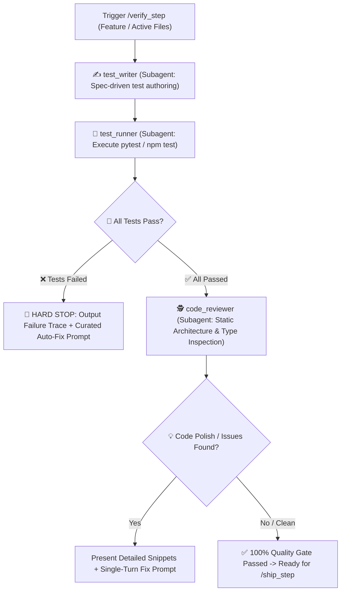

# 🧪 Verify Step — Dynamic & Static Quality Gate Pipeline

`verify_step` is the automated quality gate for Safe Yatra. It guarantees that newly written code **actually works dynamically** (automated unit/integration tests pass) AND **is architecturally sound statically** (reviewed for types, conventions, error handling, and performance) before any code is committed or merged into `main`.

---

## 🔄 End-to-End Pipeline Workflow



---

## 🔒 Automated Execution Stages

### Stage 1: Dynamic Behavioral Verification (`test_runner`)
1. Activates **`test_writer`** subagent:
   - Reads target feature specification (`docs/specs/...`) and [`GEMINI.md`](file:///d:/SIH%202026/GEMINI.md) contracts.
   - Writes black-box tests covering happy paths, edge cases, schema validations, error timeouts, and auth guards.
   - Saves tests to `ml-risk-engine/tests/` (`pytest`) or `backend-spatial/tests/` (`jest`/`vitest`).
2. Activates **`test_runner`** subagent:
   - Executes ONLY the targeted test file (`pytest tests/test_<feature>.py -v` or `npm test -- tests/<feature>.test.ts`).
   - Parses outputs, assertion results, and stack traces.
3. **Hard Failure Gate**:
   - If any test assertion fails, **HALT IMMEDIATELY**.
   - Do NOT run `code_reviewer` or attempt to ship broken code.
   - Output exact file & line number, expected vs actual behavior, and an executable auto-fix prompt.

---

### Stage 2: Static Architectural & Code Quality Review (`code_reviewer`)
*(Triggered only after all tests pass 100%)*
1. Inspects `git diff` and target feature files across the Safe Yatra standards:
   - **`backend-spatial`**: Enforces standard `ok()`/`fail()` response envelopes, Zod input validation, PostGIS spatial queries (`ST_DWithin`, `ST_Contains`), and room-scoped Socket.IO events.
   - **`ml-risk-engine`**: Verifies Pydantic contracts, explicit type annotations, pure scoring functions in `models/`, and HTTP timeout fallbacks in `services/`.
   - **`mobile-app`**: Checks Expo location permissions, offline SMS fallback handling, and UI component decomposition.
   - **`admin-dashboard`**: Validates TanStack Query cache invalidation and Mapbox GL resource cleanup.
2. Identifies any loose `any` types, missing try/catch blocks, hardcoded secrets, or code smells.

---

## 📤 Standard Output Format

```markdown
# 🛡️ /verify_step Quality Gate Report — [Feature Name]

### 🧪 Stage 1 — Dynamic Test Execution
- **Test File**: `[tests/test_feature.ts](file:///d:/SIH%202026/tests/test_feature.ts)`
- **Command**: `pytest tests/test_feature.py -v` (or `npm test -- ...`)
- **Status**: `✅ 6 passed, 0 failed` (or `❌ 5 passed, 1 failed`)

---

### 🚨 Test Failure Diagnosis *(Only if tests fail)*
- **Failed Assertion**: `test_weather_timeout_fallback`
- **Location**: `[services/weather_service.py:48](file:///d:/SIH%202026/ml-risk-engine/app/services/weather_service.py#L48)`
- **Root Cause**: `httpx.ConnectTimeout` was unhandled instead of returning cached score.
- **⚡ Curated Auto-Fix Prompt**:
> ```text
> Wrap external weather API call in try/except for httpx.TimeoutException and return cached_score.
> ```

---

### 🕵️ Stage 2 — Static Code Quality & Architecture Review
*(Only displayed if tests pass)*

#### 💡 Worth Improving
- **[Finding Title]**: `[file.ts:42](file:///d:/SIH%202026/path/to/file.ts#L42)`
- **Observation**: Missing Zod validation on coordinate bounds.
- **Recommended Fix**:
```typescript
// Proposed snippet
```

#### ✅ What Was Done Well
- [Highlight clean patterns, solid typing, or proper PostGIS spatial query indexing].

---

### 🚦 Final Quality Gate Verdict
- [ ] ❌ **BLOCKED**: Tests failed. Run the curated fix prompt above.
- [ ] 🟡 **PASSED WITH POLISH**: Tests pass, but review suggestions are recommended.
- [ ] 🟢 **100% READY TO SHIP**: All tests passed and code is architecturally clean. Ready for `/ship_step`.
```

---

## 🚀 Triggers

- `/verify_step`
- `/verify_step [feature-name]`
- `"Verify implementation and run tests"`
- `"Run full quality gate on recent changes"`
