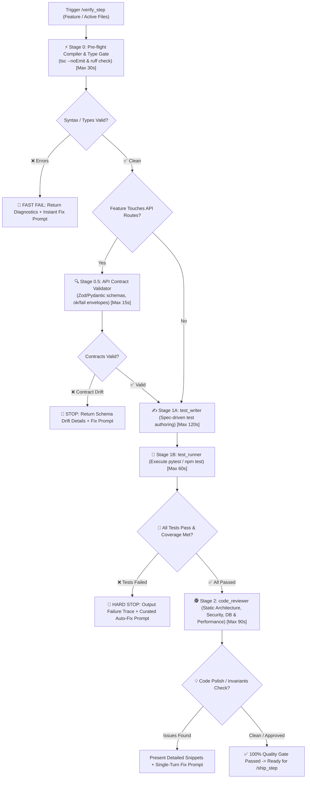

# 🧪 Verify Step — Dynamic & Static Quality Gate Pipeline

`verify_step` is the automated quality gate for Safe Yatra. It guarantees that newly written code **actually works dynamically** (automated unit/integration tests pass with $\ge 80\%$ coverage), **conforms to API contracts** (Zod/Pydantic & standard envelopes), AND **is architecturally sound statically** (reviewed for types, spatial invariants, security, and performance) before any code is committed or merged into `main`.

---

## 🔄 End-to-End Pipeline Workflow



---

## 🛑 MANDATORY STOP GATE: Anti-Auto-Advance Rule
> **CRITICAL RULE**: After `/verify_step` completes compiler checks, contract validation, dynamic tests, and static code review, the agent **MUST IMMEDIATELY STOP** and present the Quality Gate Report.
> **DO NOT** commit changes to git.
> **DO NOT** push to GitHub.
> **DO NOT** open a PR or merge into main.
> **DO NOT** trigger `/ship_step` automatically.
> Wait for the user to review and explicitly trigger `/ship_step`. The only exception is `/auto_cycle`.

---

## ⏱️ Timeout & Budget Guardrails

To prevent hangs or infinite loops during verification:

| Stage | Operation | Max Wall-Clock Time | Failure Action |
| :--- | :--- | :--- | :--- |
| **Stage 0** | Compiler & Lint Check | **30s** | Kill process, output type errors |
| **Stage 0.5** | API Contract Validation | **15s** | Halt on schema drift or missing response envelopes |
| **Stage 1A** | `test_writer` Authoring | **120s** | Check syntax, verify test file exists |
| **Stage 1B** | `test_runner` Execution | **60s** per test file | Terminate hung test, diagnose async lock |
| **Stage 2** | `code_reviewer` Review | **90s** | Generate actionable fix prompt |

---

## 🔒 Automated Execution Stages

### Stage 0: Pre-flight Compiler & Type Gate (Instant Diagnostic)
Before invoking testing subagents, execute a fast static compilation sweep scoped to modified modules:
1. **TypeScript Modules (`backend-spatial`, `mobile-app`, `admin-dashboard`)**:
   - Run `npx tsc --noEmit` within the target module directory.
2. **Python Module (`ml-risk-engine`)**:
   - Run `ruff check .` (or `mypy app/`) to verify syntax, imports, and type annotations.
3. **Fast-Fail Gate**:
   - If syntax, import, or type errors are discovered, **HALT IMMEDIATELY**.
   - Output the exact compiler errors and provide an instant fix prompt without wasting token cycles on dynamic test authoring.

---

### Stage 0.5: API Contract Validator (`api_contract_validator`)
*(Triggered conditionally when the feature touches REST routes, controllers, or schemas)*
1. **Target Files**: `*.routes.ts`, `*.controller.ts`, `app/main.py`, `app/schemas/*.py`.
2. **Contract Invariants Verified**:
   - **Response Envelope Compliance**:
     - Success returns `ok(res, data)` $\rightarrow$ `{ success: true, data: {...}, error: null }`.
     - Error returns `fail(res, code, message)` $\rightarrow$ `{ success: false, data: null, error: { code: '...', message: '...' } }`.
   - **Schema Validation**:
     - All incoming request bodies and query parameters are parsed with Zod schemas (`backend-spatial`) or Pydantic models (`ml-risk-engine`).
   - **HTTP Status Code Conformity**:
     - `200 OK` (retrieval/update), `201 Created` (resource creation), `400 Bad Request` (Zod validation error), `401 Unauthorized` (missing/invalid JWT), `403 Forbidden` (role unauthorized), `404 Not Found`.
   - **Coordinate Payload Standard**:
     - Client request and response bodies use `{ lat, lng }` or `{ latitude, longitude }` ordering.
3. If contract drift is detected, **HALT IMMEDIATELY** and report the exact schema discrepancy before authoring tests.

---

### Stage 1: Dynamic Behavioral Verification (`test_writer` ➔ `test_runner`)
*(Triggered only after Stage 0 and Stage 0.5 pass cleanly)*

#### Stage 1A — Test Authoring ([`test_writer`](file:///d:/SIH%202026/.agents/skills/test_writer/SKILL.md)):
1. Reads target feature specification (`docs/specs/...`) and [`GEMINI.md`](file:///d:/SIH%202026/GEMINI.md) contracts.
2. Employs standardized module fixtures from the **Multi-Framework Testing & Mocking Catalog** (`pytest-asyncio`, `respx`, `supertest`, `ioredis-mock`, `socket.io-client`, React Native TurboModule mocks, TanStack Query wrapper).
3. Enforces **Spatial Coordinate Invariant Testing** (`[lat, lng]` client vs `[lng, lat]` PostGIS GeoJSON).
4. Writes tests targeting:
   - Line coverage: $\ge 80\%$
   - Branch coverage: $\ge 70\%$
   - API endpoints: $100\%$ route coverage (including 200/201 happy paths and 400/401/403 failure envelopes)
5. Saves tests to `ml-risk-engine/tests/` or `backend-spatial/tests/`.

#### Stage 1B — Test Execution (`test_runner`):
1. Runs strictly **AFTER** `test_writer` completes and validates test syntax.
2. Executes ONLY the targeted test file (`pytest tests/test_<feature>.py -v` or `npm test -- tests/<feature>.test.ts`).
3. Parses assertion results and coverage.
4. **Hard Failure Gate**:
   - If any test fails or coverage is unmet, **HALT IMMEDIATELY**.
   - Do NOT run `code_reviewer` on broken code.
   - Output exact file & line number, expected vs actual behavior, and an executable auto-fix prompt.

---

### Stage 2: Static Architecture, Security & Performance Review ([`code_reviewer`](file:///d:/SIH%202026/.agents/skills/code_reviewer/SKILL.md))
*(Triggered only after all tests pass 100%)*
1. Inspects `git diff` against **Safe Yatra Invariants**:
   - **Spatial & PostGIS**: `ST_DWithin` with `::geography` cast (meters), SRID 4326 `[lng, lat]` order, GiST indexes.
   - **Distributed Concurrency**: Atomic SQL transitions (`WHERE status = 'MATCHING'`) or Redis lock for SOS assignment.
   - **Deep Security Checklist**: SQL injection in PostGIS raw queries, JWT validation, rate limiting on SOS, upload sanitization, CORS/WebSocket auth.
   - **Performance Checklist**: Prisma N+1 query detection, spatial bounding box limits, WebSocket listener cleanup, `asyncio.to_thread` for CPU scoring.
   - **Database Migration Safety**: GiST spatial index preservation, SRID 4326 compliance, zero-downtime column nullability.
2. Formats all suggestions with concrete line numbers, drop-in replacement snippets, and a single-turn copy-pasteable fix prompt.

---

## 📤 Standard Output Format

```markdown
# 🛡️ /verify_step Quality Gate Report — [Feature Name]

### ⚡ Stage 0 — Pre-flight Compilation & Types
- **Commands**: `tsc --noEmit` & `ruff check .`
- **Status**: `✅ 0 type errors, 0 lint errors`

---

### 🔍 Stage 0.5 — API Contract Validation
*(Included if feature touches API routes)*
- **Status**: `✅ API contracts compliant with GEMINI.md Section 9 (Zod validated, ok/fail envelopes confirmed)`

---

### 🧪 Stage 1 — Dynamic Test Execution
- **Stage 1A (Authoring)**: `test_writer` generated `[tests/test_feature.ts](file:///d:/SIH%202026/tests/test_feature.ts)`
- **Stage 1B (Execution)**: `pytest tests/test_feature.py -v` (or `npm test -- ...`)
- **Status**: `✅ 6 passed, 0 failed`
- **Coverage**: `Line: 88%, Branch: 76%, Routes: 100%`

---

### 🚨 Test Failure Diagnosis *(Only if tests fail)*
- **Failed Assertion**: `test_weather_timeout_fallback`
- **Location**: `[services/weather_service.py:48](file:///d:/SIH%202026/ml-risk-engine/app/services/weather_service.py#L48)`
- **Root Cause**: `httpx.ConnectTimeout` was unhandled instead of returning cached score.
- **⚡ Curated Auto-Fix Prompt**:
> ```text
> Wrap external weather API call in try/except for httpx.TimeoutException and return cached_score.
> ```

---

### 🕵️ Stage 2 — Static Code Quality, Security & Performance Review
*(Only displayed if tests pass)*

#### 🛡️ Security, Database & Invariants Audit
- [x] PostGIS SQL Injection Check: `PASSED` (All queries parameterized)
- [x] Coordinate Invariant Check: `PASSED` (`[lng, lat]` used for PostGIS SRID 4326)
- [x] Atomic SOS transitions guarded against race conditions
- [x] Database Migration Safety: `PASSED` (GiST index declared, zero-downtime nullable fields)

#### 💡 Worth Improving
- **[Finding Title]**: `[file.ts:42](file:///d:/SIH%202026/path/to/file.ts#L42)`
- **Observation**: Missing `::geography` cast in `ST_DWithin` query causing radius calculation in degrees.
- **Recommended Fix**:
```typescript
// Proposed snippet
```

#### ✅ What Was Done Well
- [Highlight clean patterns, solid typing, or proper PostGIS spatial query indexing].

---

### 🚦 Final Quality Gate Verdict
- [ ] ❌ **BLOCKED**: Compilation, contracts, or tests failed. Run the curated fix prompt above.
- [ ] 🟡 **PASSED WITH POLISH**: Tests pass, but review suggestions are recommended.
- [ ] 🟢 **100% READY TO SHIP**: All tests passed, contracts verified, security checked, and code is architecturally clean. Ready for `/ship_step`.
```

---

## 🚀 Triggers

- `/verify_step`
- `/verify_step [feature-name]`
- `"Verify implementation and run tests"`
- `"Run full quality gate on recent changes"`
