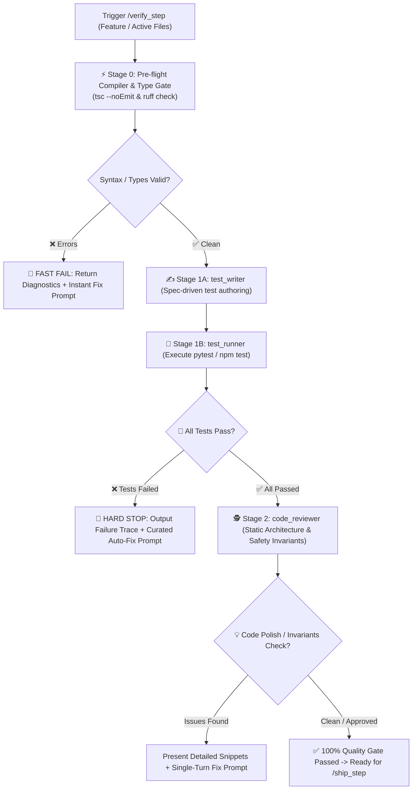

# 🧪 Verify Step — Dynamic & Static Quality Gate Pipeline

`verify_step` is the automated quality gate for Safe Yatra. It guarantees that newly written code **actually works dynamically** (automated unit/integration tests pass) AND **is architecturally sound statically** (reviewed for types, conventions, error handling, and performance) before any code is committed or merged into `main`.

---

## 🔄 End-to-End Pipeline Workflow



---

## 🔒 Automated Execution Stages

### Stage 0: Pre-flight Compiler & Type Gate (Instant Diagnostic)
Before invoking subagents or generating test suites, execute a fast static compilation and linting sweep:
1. **TypeScript Modules (`backend-spatial`, `mobile-app`, `admin-dashboard`)**:
   - Run `npx tsc --noEmit` to verify type completeness and interface contracts.
2. **Python Module (`ml-risk-engine`)**:
   - Run `ruff check .` (or `mypy app/`) to verify syntax, imports, and type annotations.
3. **Fast-Fail Gate**:
   - If syntax, import, or type errors are discovered, **HALT IMMEDIATELY**.
   - Output the exact compiler errors and provide an instant fix prompt without wasting token cycles on dynamic test authoring.

---

### Stage 1: Dynamic Behavioral Verification (`test_runner`)
*(Triggered only after Stage 0 passes cleanly)*
1. Activates **`test_writer`** subagent:
   - Reads target feature specification (`docs/specs/...`) and [`GEMINI.md`](file:///d:/SIH%202026/GEMINI.md) contracts.
   - Employs standardized module fixtures from the **Multi-Framework Testing & Mocking Catalog** (`pytest-asyncio`, `respx`, `supertest`, `ioredis-mock`, `socket.io-client`, React Native TurboModule mocks, TanStack Query wrapper).
   - Enforces **Spatial Coordinate Invariant Testing** (`[lat, lng]` client vs `[lng, lat]` GIS).
   - Writes black-box tests covering happy paths, edge cases, schema validations, error timeouts, and auth guards.
   - Saves tests to `ml-risk-engine/tests/` (`pytest`) or `backend-spatial/tests/` (`jest`/`vitest`).
2. Activates **`test_runner`** subagent:
   - Executes ONLY the targeted test file (`pytest tests/test_<feature>.py -v` or `npm test -- tests/<feature>.test.ts`).
   - Parses outputs, assertion results, and stack traces.
3. **Hard Failure Gate**:
   - If any test assertion fails, **HALT IMMEDIATELY**.
   - Do NOT run `code_reviewer` or attempt to ship broken code.
   - Output exact file & line number, expected vs actual behavior, and an executable auto-fix prompt.

---

### Stage 2: Static Architectural & Code Quality Review (`code_reviewer`)
*(Triggered only after all tests pass 100%)*
1. Inspects `git diff` and target feature files against **Safe Yatra Mission-Critical Invariants**:
   - **`backend-spatial`**: Enforces standard `ok()`/`fail()` response envelopes, Zod input validation, PostGIS spatial queries (`ST_DWithin` with `::geography` cast, SRID 4326 `[lng, lat]` order, GiST indexes), and atomic SOS status transitions (`WHERE status = 'MATCHING'`) / Redis distributed locks.
   - **`ml-risk-engine`**: Verifies Pydantic contracts, explicit type annotations, pure scoring functions in `models/`, HTTP timeout fallbacks in `services/`, and non-blocking Scikit-learn/Numpy scoring via `asyncio.to_thread()`.
   - **`mobile-app`**: Checks Expo location permissions (Foreground + Background), offline SMS fallback handling, and resource lifecycle cleanup (`watchPositionAsync`, `Audio.Recording` in `useEffect` return).
   - **`admin-dashboard`**: Validates `"use client"` boundaries, SSR guards on Mapbox GL / Leaflet (`typeof window !== 'undefined'`), and TanStack Query cache invalidation.
2. Identifies any loose `any` types, missing try/catch blocks, hardcoded secrets, or code smells.

---

## 📤 Standard Output Format

```markdown
# 🛡️ /verify_step Quality Gate Report — [Feature Name]

### ⚡ Stage 0 — Pre-flight Compilation & Types
- **Commands**: `tsc --noEmit` & `ruff check .`
- **Status**: `✅ 0 type errors, 0 lint errors` (or `❌ 2 type errors found`)

---

### 🧪 Stage 1 — Dynamic Test Execution
- **Test File**: `[tests/test_feature.ts](file:///d:/SIH%202026/tests/test_feature.ts)`
- **Command**: `pytest tests/test_feature.py -v` (or `npm test -- ...`)
- **Status**: `✅ 6 passed, 0 failed` (or `❌ 5 passed, 1 failed`)

---

### 🚨 Test Failure Diagnosis *(Only if tests fail)*
- **Failed Assertion**: `test_weather_timeout_fallback`
- **Location**: `[services/weather_service.py:48](file:///d:/SIH%202026/ml-risk-engine/app/services/weather_service.py#L48)`
- **Root Cause**: `httpx.ConnectTimeout` was unhandled instead of returning cached score.
- **⚡ Curated Auto-Fix Prompt**:
> ```text
> Wrap external weather API call in try/except for httpx.TimeoutException and return cached_score.
> ```

---

### 🕵️ Stage 2 — Static Code Quality & Architecture Review
*(Only displayed if tests pass)*

#### 💡 Worth Improving
- **[Finding Title]**: `[file.ts:42](file:///d:/SIH%202026/path/to/file.ts#L42)`
- **Observation**: Missing `::geography` cast in `ST_DWithin` query causing radius calculation in degrees.
- **Recommended Fix**:
```typescript
// Proposed snippet
```

#### ✅ What Was Done Well
- [Highlight clean patterns, solid typing, or proper PostGIS spatial query indexing].

---

### 🚦 Final Quality Gate Verdict
- [ ] ❌ **BLOCKED**: Compilation or tests failed. Run the curated fix prompt above.
- [ ] 🟡 **PASSED WITH POLISH**: Tests pass, but review suggestions are recommended.
- [ ] 🟢 **100% READY TO SHIP**: All tests passed and code is architecturally clean. Ready for `/ship_step`.
```

---

## 🚀 Triggers

- `/verify_step`
- `/verify_step [feature-name]`
- `"Verify implementation and run tests"`
- `"Run full quality gate on recent changes"`
