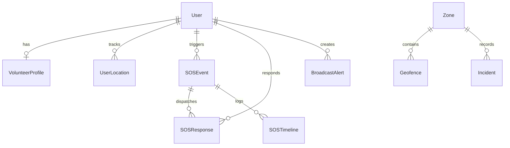

# 📄 Technical Specification: Prisma PostGIS Spatial Schema & Models

> **Step ID**: `2.2`  
> **Target Module**: `backend-spatial` / `data`  
> **Git Feature Branch**: `feat/step-2-2-prisma-postgis-schema`  
> **Status**: 📋 Draft / Ready for Implementation  
> **Created**: 2026-08-28  

---

## 1. Executive Summary

Step 2.2 defines the foundational relational and geospatial database schema for the Safe Yatra backend using Prisma ORM with the PostgreSQL `postgis` extension enabled. It models all 10 core entities defined in `GEMINI.md` Section 8 (`User`, `VolunteerProfile`, `UserLocation`, `Zone`, `Geofence`, `BroadcastAlert`, `SOSEvent`, `SOSResponse`, `SOSTimeline`, and `Incident`), establishing native SRID 4326 PostGIS geometry fields (`Point` and `Polygon`), strict enum state machines, and relational foreign keys.

---

## 2. Dependencies & Prerequisites

- **Depends on**:
  - PostgreSQL 16 + PostGIS 3.4 container (`docker-compose.yml`).
  - Backend dependencies (`@prisma/client`, `prisma`).
- **Blocked by**: None.
- **New Packages**: None (`prisma` & `@prisma/client` already in `backend-spatial/package.json`).

---

## 3. 🧠 Sequential Thinking Strategy
> *Algorithmic & Spatial Complexity Evaluation*

- **Complexity Tier**: High (PostGIS Geometry Fields, Foreign Key Relations, Spatial Coordinate Indexing).
- **Sequential Thinking MCP**: `Recommended`
  - **SRID 4326 Coordinate Invariant**: In PostGIS SQL, `ST_SetSRID(ST_MakePoint(lng, lat), 4326)` requires longitude as the first parameter. Models must store explicit `latitude` and `longitude` float mirrors alongside the binary `Unsupported("geometry(Point, 4326)")` column to enable fast non-spatial indexing and zero-overhead REST serialization.
  - **Prisma PostGIS Preview Feature**: Must include `previewFeatures = ["postgresqlExtensions"]` and `extensions = [postgis]` in `schema.prisma`.
  - **SOS Lifecycle Transitions**: Enforce `SOSEventStatus` and `SOSResponseStatus` enums to prevent illegal out-of-order state transitions.

---

## 4. Data Models & Schema Specifications

### 4.1 Enums Defined
- `UserRole`: `TOURIST`, `YAATRI_MITRA`, `ADMIN`
- `VerificationStatus`: `PENDING`, `VERIFIED`, `REJECTED`
- `DangerTier`: `LOW`, `MODERATE`, `SEVERE`, `CRITICAL`
- `AlertSeverity`: `INFO`, `WARNING`, `CRITICAL`
- `SOSEventStatus`: `TRIGGERED`, `VOLUNTEERS_ALERTED`, `VOLUNTEER_ACCEPTED`, `VOLUNTEER_ARRIVED`, `RESOLVED`, `CANCELLED`, `ESCALATED_POLICE`
- `SOSTriggerMethod`: `APP_WEBSOCKET`, `APP_REST`, `SMS_FALLBACK`, `MANUAL_ADMIN`
- `SOSResponseStatus`: `ALERTED`, `ACCEPTED`, `DECLINED`, `ARRIVED`, `COMPLETED`
- `IncidentType`: `DROWNING`, `STAMPEDE`, `LANDSLIDE`, `FLASH_FLOOD`, `THEFT`, `MEDICAL_EMERGENCY`, `LOST_PERSON`, `OTHER`
- `IncidentSeverity`: `LOW`, `MEDIUM`, `HIGH`, `FATAL`

### 4.2 Entity Relations


---

## 5. Step-by-Step Implementation Sequence

1. **Phase A: Prisma Schema Configuration**
   - [ ] Author `backend-spatial/prisma/schema.prisma` with `postgis` extension enabled.
   - [ ] Define all 9 Enums and 10 Models with PostGIS `Unsupported("geometry(...)")` spatial columns.

2. **Phase B: Schema Validation & Generation**
   - [ ] Run `npx prisma validate` in `backend-spatial/` to confirm syntax and relation integrity.
   - [ ] Generate Prisma Client types via `npx prisma generate`.

3. **Phase C: Automated Checks**
   - [ ] Validate generated client models match TypeScript types.

---

## 6. Edge Cases & Failure Recovery

- **Prisma Client Generation without Database Connection**: `prisma generate` creates TypeScript types statically from the schema without requiring an active PostgreSQL container connection.
- **Unsupported Geometry Type Handling**: Prisma generates `$queryRaw` helpers for inserting and querying `Unsupported("geometry(...)")` columns via `ST_GeomFromGeoJSON` and `ST_AsGeoJSON`.

---

## 7. Verification & Acceptance Criteria

### Automated Tests
```bash
cd backend-spatial && npx prisma validate
```

### Acceptance Checklist
- [ ] `backend-spatial/prisma/schema.prisma` created containing all 10 models and 9 enums.
- [ ] PostGIS extension enabled in datasource block.
- [ ] `npx prisma validate` passes with zero errors.
