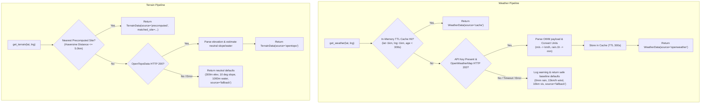

# 📋 Technical Specification: Step 3.5a — Weather & Terrain External Data Services

> **Module**: `ml-risk-engine`  
> **Feature**: Meteorological (OpenWeatherMap) & Topographical (OpenTopoData / Offline Profiles) Data Services with Fallback Caching  
> **Branch**: `feat/step-3-5a-weather-terrain-services`  
> **Status**: 📋 Planning Phase  
> **Target Verification**: `pytest tests/test_weather_service.py tests/test_terrain_service.py`

---

## 1. Executive Summary & Purpose

The ML Risk Engine computes dynamic danger scores using real-time weather and topographical parameters. **Step 3.5a** delivers the first half of the external data ingestion pipeline by implementing resilient, async services for:
1. **Weather Ingestion (`WeatherService`)**: Querying OpenWeatherMap (precip, wind, visibility, temp) with in-memory coordinate-quantized TTL caching and deterministic fallback conditions during API downtime or network outages.
2. **Topographical Profiles (`TerrainService`)**: Precomputed offline terrain profiles (`data/terrain_profiles.json`) with nearest-neighbor Haversine matching for pilot pilgrimage/trekking zones (Lonavala, Bhushi Dam, Tiger Point, Karla Caves, Rajmachi Fort, Khandala Ghat), plus OpenTopoData fallback.

---

## 2. 5-Gate Goldilocks Granularity Assessment

| Gate | Standard | Evaluation | Result |
| :--- | :--- | :--- | :--- |
| **1. File Scope** | $\le 3$ implementation files | 3 files (`weather_service.py`, `terrain_service.py`, `data/terrain_profiles.json`, `__init__.py`) | ✅ PASS |
| **2. Code Volume** | $\le 320$ LOC logic | Estimated ~230 LOC total implementation | ✅ PASS |
| **3. Architectural Focus** | Single distinct concern | External environmental data acquisition & resilient fallback | ✅ PASS |
| **4. Verification** | 1 targeted test command | `pytest tests/test_weather_service.py tests/test_terrain_service.py` | ✅ PASS |
| **5. Context Headroom** | $\ge 40\%$ context window | ~45% context headroom reserved for review & test execution | ✅ PASS |

---

## 3. Architecture & Data Contracts

### 3.1 Data Structures

```python
class WeatherData(BaseModel):
    precipitation_mm: float = Field(0.0, ge=0.0, description="Rainfall in mm over last 1-3 hours")
    wind_speed_kmh: float = Field(0.0, ge=0.0, description="Wind speed in km/h")
    visibility_meters: float = Field(10000.0, ge=0.0, le=10000.0, description="Visibility in meters")
    temperature_c: float = Field(25.0, description="Temperature in Celsius")
    description: str = Field("Clear", description="Weather description text")
    is_cached: bool = Field(False, description="Whether data was served from cache")
    source: str = Field("openweather", description="Data origin: 'openweather' | 'cache' | 'fallback'")


class TerrainData(BaseModel):
    elevation_meters: float = Field(0.0, ge=-500.0, le=9000.0, description="Altitude in meters")
    slope_degrees: float = Field(0.0, ge=0.0, le=90.0, description="Incline slope in degrees")
    water_proximity_meters: float = Field(1000.0, ge=0.0, description="Distance to water body in meters")
    terrain_type: str = Field("general", description="Categorical terrain description")
    matched_site: Optional[str] = Field(None, description="Matched pilot site identifier if found")
    source: str = Field("precomputed", description="Data origin: 'precomputed' | 'opentopo' | 'fallback'")
```

---

## 4. Fallback Cascade & Caching Strategy



---

## 5. Precomputed Pilot Sites (`data/terrain_profiles.json`)

| Site Identifier | Location (Lat, Lng) | Elevation (m) | Slope (°) | Water Proximity (m) | Terrain Type |
| :--- | :--- | :--- | :--- | :--- | :--- |
| `lonavala_bhushi_dam` | $18.7546, 73.4062$ | $610.0$ | $45.0$ | $12.0$ | `waterfall_basin` |
| `lonavala_tiger_point` | $18.7833, 73.3833$ | $650.0$ | $60.0$ | $500.0$ | `cliff_edge` |
| `lonavala_karla_caves` | $18.7830, 73.4750$ | $620.0$ | $30.0$ | $800.0$ | `rock_cut_steps` |
| `lonavala_rajmachi_fort`| $18.8250, 73.4000$ | $830.0$ | $55.0$ | $350.0$ | `mountain_ridge` |
| `lonavala_khandala_ghat`| $18.7500, 73.3600$ | $550.0$ | $40.0$ | $200.0$ | `valley_slope` |

---

## 6. Implementation Plan & Target Files

1. **`ml-risk-engine/data/terrain_profiles.json`** [NEW]
   - JSON array with site name, coordinates, elevation, slope, water proximity, and terrain classification.
2. **`ml-risk-engine/app/services/weather_service.py`** [NEW]
   - Async `WeatherService` class with `httpx.AsyncClient`.
   - Parsing of OpenWeatherMap standard payload (`weather[0].description`, `main.temp - 273.15`, `wind.speed * 3.6`, `rain.1h` / `rain.3h`, `visibility`).
   - Coordinate quantization (`round(coord, 2)`) and TTL caching.
   - Graceful fallback on API key missing, timeout ($3.0\text{s}$), or HTTP errors.
3. **`ml-risk-engine/app/services/terrain_service.py`** [NEW]
   - Async `TerrainService` class.
   - Haversine distance calculations against `terrain_profiles.json`.
   - OpenTopoData elevation query fallback and default terrain baselines.
4. **`ml-risk-engine/app/services/__init__.py`** [MODIFY]
   - Export `WeatherService`, `WeatherData`, `TerrainService`, `TerrainData`, and default singleton instances.

---

## 7. Verification & Testing Plan

### Automated Unit Tests
- `tests/test_weather_service.py`:
  - Test successful OWM parsing and unit conversion ($m/s \rightarrow km/h$, $K \rightarrow ^\circ C$).
  - Test TTL cache hit (verify second call does not trigger HTTP request).
  - Test timeout / network error fallback (returns default `WeatherData` with `source='fallback'`).
  - Test missing API key graceful fallback.
- `tests/test_terrain_service.py`:
  - Test precomputed profile exact & nearby match ($< 5\text{km}$ radius) with correct slope and water proximity.
  - Test distance attenuation (point $> 5\text{km}$ outside known sites triggers API/fallback).
  - Test OpenTopoData mock response parsing and error fallback.

### Target Command
```bash
pytest tests/test_weather_service.py tests/test_terrain_service.py -v
```
