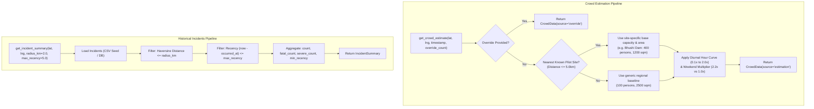

# 📋 Technical Specification: Step 3.5b — Crowd Estimation & Incident Database Data Services

> **Module**: `ml-risk-engine`  
> **Feature**: Temporal & Capacity-Based Crowd Density Estimation (`CrowdService`) and Historical Spatial Incident Aggregation (`IncidentService`)  
> **Branch**: `feat/step-3-5b-crowd-incident-services`  
> **Status**: 📋 Planning Phase  
> **Target Verification**: `pytest tests/test_crowd_service.py tests/test_incident_service.py`

---

## 1. Executive Summary & Purpose

Step 3.5b delivers the second half of the ML Risk Engine's external data ingestion layer by implementing:
1. **Dynamic Crowd Estimation (`CrowdService`)**: A temporal and spatial footfall estimation engine modeling diurnal tourist influx (hour-of-day peak curves), weekend surge multipliers, and site-specific walkable surface areas ($m^2$) to derive crowd density.
2. **Historical Incident Aggregation (`IncidentService`)**: An incident resolution service querying past safety incidents from `data/historical_incidents.csv` (and database), filtering via Haversine great-circle radius ($2.0\text{km}$), and aggregating fatalities, severe injuries, and recency years for `compute_historical_risk`.

---

## 2. 5-Gate Goldilocks Granularity Assessment

| Gate | Standard | Evaluation | Result |
| :--- | :--- | :--- | :--- |
| **1. File Scope** | $\le 3$ implementation files | 3 files (`crowd_service.py`, `incident_service.py`, `data/historical_incidents.csv`, `__init__.py`) | ✅ PASS |
| **2. Code Volume** | $\le 320$ LOC logic | Estimated ~220 LOC total implementation | ✅ PASS |
| **3. Architectural Focus** | Single distinct concern | Crowd density modeling & historical incident spatial aggregation | ✅ PASS |
| **4. Verification** | 1 targeted test command | `pytest tests/test_crowd_service.py tests/test_incident_service.py` | ✅ PASS |
| **5. Context Headroom** | $\ge 40\%$ context window | ~45% context headroom reserved | ✅ PASS |

---

## 3. Architecture & Data Contracts

### 3.1 Data Structures

```python
class CrowdData(BaseModel):
    crowd_count: int = Field(0, ge=0, description="Estimated or observed number of persons present")
    area_sqm: float = Field(2500.0, gt=0.0, description="Walkable surface area in square meters")
    density_persons_sqm: float = Field(0.0, ge=0.0, description="Crowd density in persons/m^2")
    event_multiplier: float = Field(1.0, ge=0.5, le=5.0, description="Surge multiplier based on day/time/events")
    matched_site: Optional[str] = Field(None, description="Matched pilot profile identifier if near a known site")
    source: str = Field("estimation", description="Data origin: 'estimation' | 'override' | 'fallback'")


class IncidentSummary(BaseModel):
    incident_count: int = Field(0, ge=0, description="Total incidents within search radius")
    fatal_count: int = Field(0, ge=0, description="Total fatalities across matched incidents")
    severe_count: int = Field(0, ge=0, description="Total severe non-fatal incidents")
    radius_km: float = Field(2.0, gt=0.0, description="Search radius in kilometers")
    recency_years: float = Field(5.0, ge=0.0, description="Years since the most recent incident")
    incidents: list[dict[str, Any]] = Field(default_factory=list, description="List of matched incident records")
    source: str = Field("csv_seed", description="Data origin: 'database' | 'csv_seed' | 'fallback'")
```

---

## 4. Heuristic & Spatial Aggregation Logic



---

## 5. Seed Dataset: `data/historical_incidents.csv`

Contains historical safety incidents synchronized with `backend-spatial/prisma/seed.ts`:
- **Incidents**: Flash floods & drowning at Bhushi Dam, cliff falls at Tiger Point, trekking slips at Rajmachi Fort, mudslides at Khandala Ghat.
- **Attributes**: `incident_id`, `title`, `incident_type`, `severity`, `lat`, `lng`, `occurred_at`, `fatalities`, `injuries`, `description`.

---

## 6. Implementation Plan & Target Files

1. **`ml-risk-engine/data/historical_incidents.csv`** [NEW]
   - Structured CSV dataset with real-world incident fixtures.
2. **`ml-risk-engine/app/services/crowd_service.py`** [NEW]
   - Async `CrowdService` with temporal hour-of-day curve, weekend multiplier, pilot site capacity profiles, and override ingestion.
3. **`ml-risk-engine/app/services/incident_service.py`** [NEW]
   - Async `IncidentService` with CSV loader, Haversine spatial distance filter, and recency/severity aggregation.
4. **`ml-risk-engine/app/services/__init__.py`** [MODIFY]
   - Export `CrowdService`, `CrowdData`, `IncidentService`, `IncidentSummary`, and default singletons.

---

## 7. Verification & Testing Plan

### Automated Unit Tests
- `tests/test_crowd_service.py`:
  - Test baseline diurnal hour variation (midday peak vs midnight drop).
  - Test weekend vs weekday multiplier.
  - Test known pilot site capacity match (Bhushi Dam, Tiger Point).
  - Test manual override pass-through.
- `tests/test_incident_service.py`:
  - Test exact and nearby coordinate spatial radius filtering ($<2.0\text{km}$).
  - Test fatality and severity counting accuracy.
  - Test zero-incident fallback when querying remote coordinates ($>10\text{km}$).
  - Test recency decay calculation.

### Target Command
```bash
pytest tests/test_crowd_service.py tests/test_incident_service.py -v
```
