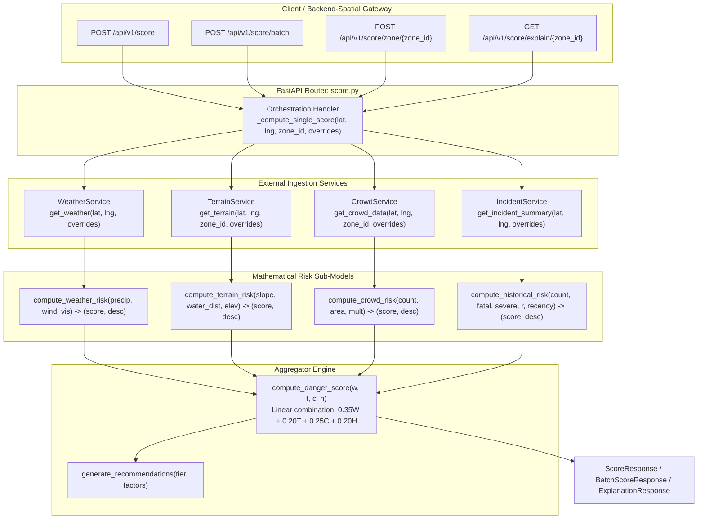

# 📋 Technical Specification: Step 3.6a — Core FastAPI Scoring Routers & Orchestration

> **Module**: `ml-risk-engine`  
> **Feature**: HTTP Endpoints for Single Coordinate, Batch, Zone-Level Scoring & Safety Explanations (`score_router`)  
> **Branch**: `feat/step-3-6a-fastapi-scoring-routes`  
> **Status**: 📋 Planning Phase  
> **Target Verification**: `pytest tests/test_score_router.py`

---

## 1. Executive Summary & Purpose

Step 3.6a implements the core HTTP API routing and service orchestration layer for the Safe Yatra **ML Risk Engine**. It bridges incoming REST API requests from `backend-spatial`, the mobile app, and the admin dashboard to the underlying four risk sub-models (`weather`, `terrain`, `crowd`, `history`), external data ingestion services, and the convex score aggregator.

### Key Capabilities
1. **Single Coordinate Scoring (`POST /api/v1/score`)**: Ingests `ScoreRequest`, queries data services, normalizes risk sub-scores, computes composite danger score ($0–100$), determines risk tier, and returns `ScoreResponse`.
2. **Batch Coordinate Scoring (`POST /api/v1/score/batch`)**: Concurrently evaluates up to 100 coordinates with support for global and point-level simulation overrides, returning `BatchScoreResponse`.
3. **Predefined Zone Scoring (`POST /api/v1/score/zone/{zone_id}`)**: Resolves site coordinates and profile from `data/terrain_profiles.json`, executing danger evaluation for named pilgrimage/trekking zones (e.g. `lonavala_bhushi_dam`, `lonavala_tiger_point`).
4. **Safety Explanations & Advisories (`GET /api/v1/score/explain/{zone_id}`)**: Generates plain-English briefings, sub-factor breakdowns, and actionable context-sensitive recommendations for field operators and tourists.

---

## 2. 5-Gate Goldilocks Granularity Assessment

| Gate | Standard | Evaluation | Result |
| :--- | :--- | :--- | :--- |
| **1. File Scope** | $\le 3$ implementation files | 3 files (`app/routes/score.py`, `app/routes/__init__.py`, `app/main.py`) | ✅ PASS |
| **2. Code Volume** | $\le 320$ LOC logic | Estimated ~210 LOC router logic + ~110 LOC test suite | ✅ PASS |
| **3. Architectural Focus** | Single distinct concern | Core FastAPI HTTP routing and scoring service orchestration | ✅ PASS |
| **4. Verification** | 1 targeted test command | `pytest tests/test_score_router.py` | ✅ PASS |
| **5. Context Headroom** | $\ge 40\%$ context window | ~45% context headroom reserved | ✅ PASS |

---

## 3. Architecture & Data Flow



---

## 4. API Endpoints Specification

### 4.1 `POST /api/v1/score`
- **Request Body**: `ScoreRequest`
  ```json
  {
    "lat": 18.7546,
    "lng": 73.4062,
    "zone_id": "zone_lonavala_waterfall_01",
    "simulation_overrides": {
      "precipitation_mm": 180.0,
      "wind_speed_kmh": 45.0
    }
  }
  ```
- **Response**: `ScoreResponse` (Status: 200 OK)
  ```json
  {
    "zone_id": "zone_lonavala_waterfall_01",
    "coordinates": { "lat": 18.7546, "lng": 73.4062 },
    "danger_score": 85,
    "tier": "CRITICAL",
    "justification": "Danger Score: 85 — High risk of flash flooding...",
    "factors": { ... },
    "computed_at": "2026-08-29T03:40:00Z",
    "ttl_seconds": 300
  }
  ```

### 4.2 `POST /api/v1/score/batch`
- **Request Body**: `BatchScoreRequest` (1 to 100 points, optional global `simulation_overrides`)
- **Response**: `BatchScoreResponse` (Status: 200 OK) with `results: List[ScoreResponse]` and `total_computed: int`.

### 4.3 `POST /api/v1/score/zone/{zone_id}`
- **Path Parameter**: `zone_id` (e.g. `lonavala_bhushi_dam` or `zone-lonavala-bhushi-dam-01`)
- **Request Body**: `Optional[ZoneScoreRequest]` or `Optional[SimulationOverrides]`
- **Response**: `ScoreResponse` (Status: 200 OK), or `404 Not Found` if zone identifier is unrecognized.

### 4.4 `GET /api/v1/score/explain/{zone_id}`
- **Path Parameter**: `zone_id`
- **Query Parameters**: `lat: Optional[float]`, `lng: Optional[float]`
- **Response**: `ExplanationResponse` (Status: 200 OK) containing structured advisory recommendations.

---

## 5. Implementation Plan & Target Files

1. **`ml-risk-engine/app/routes/__init__.py`** [NEW]
   - Re-export `score_router`.
2. **`ml-risk-engine/app/routes/score.py`** [NEW]
   - Implement `score_router` with all four endpoints, helper orchestrator `_evaluate_point_danger`, error handling, and batch concurrency.
3. **`ml-risk-engine/app/main.py`** [MODIFY]
   - Mount `score_router` on `app` with prefix `/api/v1`.

---

## 6. Verification & Quality Gates

### Automated Test Coverage Target (`tests/test_score_router.py`)
- `test_score_single_coordinate_success`: Basic coordinate returns 200 with all 4 factors and valid tier.
- `test_score_with_simulation_overrides`: Checks that override values propagate into factor telemetry.
- `test_score_batch_success`: Batch requests compute all points with global + local override merging.
- `test_score_predefined_zone_success`: Known zone ID resolves coordinates and computes score.
- `test_score_unknown_zone_404`: Non-existent zone ID returns 404 with error detail.
- `test_score_explain_endpoint`: Validates explanation response and recommendation list.
- `test_score_invalid_coordinates_422`: Out-of-range coordinates trigger FastAPI 422 Unprocessable Entity.
