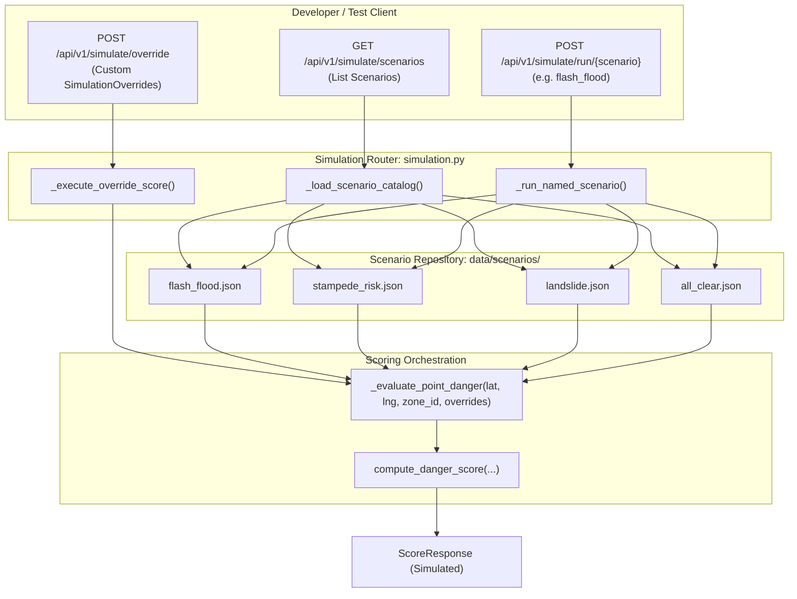

# 📋 Technical Specification: Step 3.6b — Simulation & Scenario Execution Routers

> **Module**: `ml-risk-engine`  
> **Feature**: Developer Simulation Endpoints, Environmental Parameter Injection & Scenario Runners (`simulation_router`)  
> **Branch**: `feat/step-3-6b-simulation-router`  
> **Status**: 📋 Planning Phase  
> **Target Verification**: `pytest tests/test_simulation_router.py`

---

## 1. Executive Summary & Purpose

Step 3.6b provides the developer testing, mock injection, and disaster scenario runner capabilities for the Safe Yatra **ML Risk Engine**. It allows backend developers, QA engineers, and hackathon demonstrators to simulate catastrophic weather hazards (e.g. cloudburst flash floods, landslide risks, mass-pilgrimage stampede crushes) in real time without waiting for actual extreme weather conditions.

### Key Capabilities
1. **Simulation Override Endpoint (`POST /api/v1/simulate/override`)**: Ingests arbitrary environmental parameter overrides (precipitation, wind speed, visibility, slope incline, water distance, crowd count, historical incidents) and computes deterministic risk responses.
2. **Scenario Discovery Endpoint (`GET /api/v1/simulate/scenarios`)**: Lists and inspects available disaster scenario fixtures stored in `data/scenarios/`.
3. **Scenario Execution Endpoint (`POST /api/v1/simulate/run/{scenario}`)**: Ingests scenario name (e.g. `flash_flood`, `stampede_risk`, `landslide`, `all_clear`), executes multi-variable hazard evaluation, and returns `ScoreResponse` matching the simulated event.

---

## 2. 5-Gate Goldilocks Granularity Assessment

| Gate | Standard | Evaluation | Result |
| :--- | :--- | :--- | :--- |
| **1. File Scope** | $\le 3$ implementation files | 3 code files (`app/routes/simulation.py`, `app/routes/__init__.py`, `app/main.py`) + 4 scenario JSONs | ✅ PASS |
| **2. Code Volume** | $\le 320$ LOC logic | Estimated ~180 LOC logic + ~100 LOC test suite | ✅ PASS |
| **3. Architectural Focus** | Single distinct concern | Developer simulation, mock override injection, and disaster scenario evaluation | ✅ PASS |
| **4. Verification** | 1 targeted test command | `pytest tests/test_simulation_router.py` | ✅ PASS |
| **5. Context Headroom** | $\ge 40\%$ context window | ~45% context headroom reserved | ✅ PASS |

---

## 3. Architecture & Data Flow

---

## 4. Disaster Scenario Definitions

1. **`flash_flood.json`**:
   - Site: `lonavala_bhushi_dam` (lat: 18.7546, lng: 73.4062)
   - Overrides: `precipitation_mm: 250.0`, `water_proximity_meters: 5.0`, `slope_degrees: 50.0`, `crowd_count: 500`, `historical_incident_count: 4`
   - Expected Output: Danger Score $\ge 76$ (`CRITICAL`).

2. **`stampede_risk.json`**:
   - Site: `lonavala_karla_caves` (lat: 18.783, lng: 73.475)
   - Overrides: `crowd_count: 9000`, `precipitation_mm: 5.0`, `wind_speed_kmh: 10.0`, `slope_degrees: 30.0`
   - Expected Output: Danger Score $\ge 51$ (`SEVERE` / `CRITICAL`).

3. **`landslide.json`**:
   - Site: `lonavala_rajmachi_fort` (lat: 18.825, lng: 73.400)
   - Overrides: `precipitation_mm: 180.0`, `slope_degrees: 70.0`, `elevation_meters: 830.0`
   - Expected Output: Danger Score $\ge 76$ (`CRITICAL`).

4. **`all_clear.json`**:
   - Site: `lonavala_khandala_ghat` (lat: 18.750, lng: 73.360)
   - Overrides: `precipitation_mm: 0.0`, `wind_speed_kmh: 12.0`, `visibility_meters: 10000.0`, `slope_degrees: 10.0`, `crowd_count: 40`, `historical_incident_count: 0`
   - Expected Output: Danger Score $\le 25$ (`LOW`).

---

## 5. Implementation Plan & Target Files

1. **`ml-risk-engine/data/scenarios/`** [NEW]
   - `flash_flood.json`, `stampede_risk.json`, `landslide.json`, `all_clear.json`.
2. **`ml-risk-engine/app/routes/simulation.py`** [NEW]
   - Implement `simulation_router` with `override`, `scenarios`, and `run/{scenario}` endpoints.
3. **`ml-risk-engine/app/routes/__init__.py`** [MODIFY]
   - Re-export `simulation_router`.
4. **`ml-risk-engine/app/main.py`** [MODIFY]
   - Mount `simulation_router` under prefix `/api/v1/simulate`.
5. **`ml-risk-engine/tests/test_simulation_router.py`** [NEW]
   - Unit and integration tests for all simulation endpoints and scenario executions.
