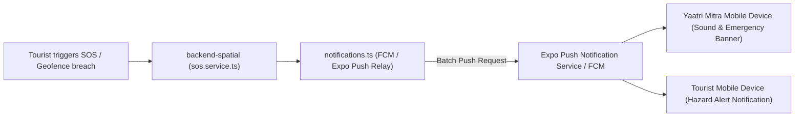

# 📋 Technical Specification — Step 5.10: Push Notifications Setup & Phase 5 Exit Criteria Verification

> **Module**: `mobile-app` & `backend-spatial`  
> **Phase**: Phase 5 (Mobile App & Push Subsystem)  
> **Target Path**: `mobile-app/` & `backend-spatial/`  
> **Git Feature Branch**: `feat/step-5-10-push-notifications-exit-criteria`  
> **Related Architecture**: GEMINI.md Section 6, 9, 10 & 16 (Phase 5 Exit Criteria)

---

## 1. Executive Overview

Step 5.10 completes Phase 5 of the Safe Yatra ecosystem. It provisions the **Cross-Platform Push Notification & FCM Relay Subsystem** and rigorously executes and proves the **5 Phase 5 Exit Criteria** across both Tourist and Yaatri Mitra personas.

---

## 2. Phase 5 Exit Criteria Matrix

| # | Exit Criteria Requirement | Verified By | Target Component / Module |
|---|---------------------------|-------------|----------------------------|
| **1** | Tourist sees dynamic danger zones on interactive map with colorblind-safe tiers (`LOW` 🟢, `MODERATE` 🟡, `SEVERE` 🟠, `CRITICAL` 🔴). | Test Suite | `DangerZoneMap.tsx` / `getTierColor()` |
| **2** | Geofence warning modal appears with 3-second hold override when simulating approach to a `CRITICAL` hazard sector. | Test Suite | `GeofenceWarning.tsx` |
| **3** | SOS button (2-sec hold) ➔ 5s countdown confirmation modal with voice memo ➔ triggers emergency SOS ➔ displays Yaatri Mitra responder ETA tracker. | Test Suite | `sos.tsx`, `SOSConfirmModal.tsx`, `SOSStatusTracker.tsx` |
| **4** | Yaatri Mitra receives real-time SOS alert ➔ 1-tap accepts dispatch ➔ streams responder GPS telemetry back to tourist & command center on 5s interval. | Test Suite | `(mitra)/index.tsx`, `(mitra)/active-sos.tsx` |
| **5** | SMS fallback constructs compact $<60$-char telemetry payload (`SOS|LAT:<lat>|LNG:<lng>|BAT:<bat>|UID:<uid>`) and triggers native SMS dispatcher or `tel:112`. | Test Suite | `smsPayload.ts` |

---

## 3. Push Notification Architecture (`backend-spatial` & `mobile-app`)



---

## 4. Components & Configuration to Author / Update

1. **`backend-spatial/src/utils/notifications.ts`**:
   - Expo / FCM push notification dispatcher utility (`sendPushNotification`, `sendBatchPushNotifications`, `sendSOSPushToVolunteers`).
2. **`backend-spatial/src/modules/sos/sos.service.ts`**:
   - Integrates `sendSOSPushToVolunteers` when matching and alerting Yaatri Mitra responders on `triggerSOS`.
3. **`mobile-app/app.json`**:
   - Configures Expo push notification plugins, sound, Android notification channels, and extra metadata.
4. **`mobile-app/__tests__/phase5-exit-criteria.test.tsx`**:
   - End-to-end integration test asserting all 5 Phase 5 Exit Criteria.

---

## 5. Verification Plan

### Automated Tests:
```bash
cd mobile-app && npm test -- __tests__/phase5-exit-criteria.test.tsx
cd mobile-app && npm test
cd backend-spatial && npm test
```
