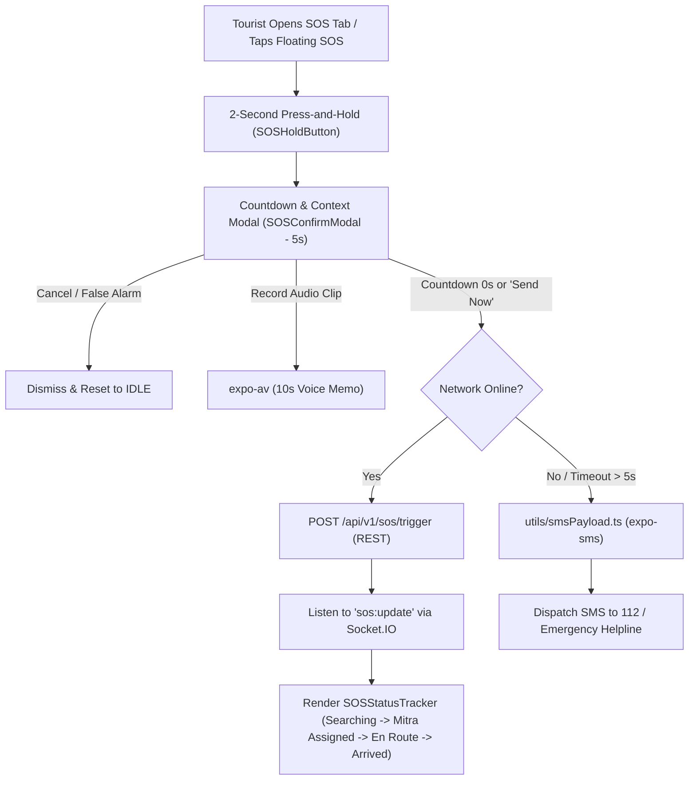

# 📋 Technical Specification — Step 5.7: Tourist SOS Screen, Countdown Panic Confirmation Modal, Status Tracker & Offline SMS Fallback

> **Module**: `mobile-app`  
> **Phase**: Phase 5 (Mobile App)  
> **Target Path**: `mobile-app/`  
> **Git Feature Branch**: `feat/step-5-7-tourist-sos-screen`  
> **Related Architecture**: GEMINI.md Section 6 & 12 (SOS Emergency Dispatch Flow & Offline Fallback)

---

## 1. Executive Overview

Step 5.7 implements the highest-stakes user-facing lifecycle flow in the Safe Yatra mobile ecosystem: the **Tourist SOS Emergency Dispatch & Life-Safety Response System**. In high-altitude pilgrimage routes and remote tourist destinations, panic buttons must guard against accidental triggering, capture critical situational context (GPS, battery, voice notes), provide real-time reassurance while searching for and tracking Yaatri Mitra responders, and seamlessly failover to offline SMS payloads when cellular data connectivity drops.

---

## 2. Architectural Responsibilities & Component Breakdown



### Components to Author:
1. **`utils/smsPayload.ts`**:
   - Encodes compact $<60$-character telemetry string: `SOS|LAT:<lat>|LNG:<lng>|BAT:<battery>|UID:<userId>`.
   - Handles `expo-sms` dispatch with fallback to native dialer `tel:112`.
2. **`components/sos/SOSConfirmModal.tsx`**:
   - 5-second countdown modal with animated progress bar.
   - Optional 10-second voice memo recording (`expo-av`).
   - "False Alarm / Cancel" and "Send Immediately" actions.
3. **`components/sos/SOSStatusTracker.tsx`**:
   - Multi-state response tracker (`SEARCHING`, `VOLUNTEER_ALERTED`, `VOLUNTEER_ACCEPTED`, `VOLUNTEER_ARRIVED`, `RESOLVED`).
   - Displays responder name, phone, distance in meters, and ETA countdown in minutes.
   - Includes "Cancel Emergency" action and Offline SMS panic backup button.
4. **`app/(tourist)/sos.tsx`**:
   - Screen mounting the press-and-hold trigger, live GPS telemetry display, direct emergency helpline pills (112, 108, 1363), and active SOS tracking state.

---

## 3. Data Contracts & State Machine

### 3.1 SOS Lifecycle State Machine
```typescript
export type SOSState = 
  | 'IDLE'                  // Ready to trigger
  | 'HOLDING'               // User currently pressing hold button
  | 'COUNTDOWN'             // 5-second pre-dispatch confirmation modal
  | 'DISPATCHING'           // Sending POST /api/v1/sos/trigger
  | 'SEARCHING'             // Dispatched, waiting for volunteer match
  | 'VOLUNTEER_ACCEPTED'    // Yaatri Mitra accepted, en route with live ETA
  | 'VOLUNTEER_ARRIVED'     // Responder reached tourist coordinates
  | 'RESOLVED'              // Emergency successfully concluded
  | 'CANCELLED';            // Tourist or admin aborted request
```

### 3.2 SMS Telemetry Format
```text
SOS|LAT:18.75460|LNG:73.40620|BAT:82|UID:usr_99182a
```
- Total length: ~52 characters (fits safely within standard 160-character single SMS limit).

---

## 4. Mobile Accessibility (A11y) & Safety Invariants

1. **Anti-Accidental Trigger Invariant**: Single accidental taps do NOT trigger emergency dispatch. The user must press and hold for 2.0 seconds, followed by a 5-second cancelable countdown window.
2. **Accessible Touch Targets**: All buttons (Panic trigger, Cancel, Audio Record, Call 112) have a minimum touch bounding box of $48\times 48\text{dp}$.
3. **Screen Reader Announcements**: State transitions (e.g. "Volunteer accepted SOS, 4 minutes away", "Emergency dispatched") trigger `AccessibilityInfo.announceForAccessibility`.
4. **Hardware Lifecycle Safety**: Audio recording instances (`Audio.Recording`) and location listeners are actively cleaned up on component unmount to prevent battery drain.

---

## 5. Verification Plan

### Automated Unit & Component Tests (`__tests__/sos-flow.test.tsx`):
- `should require 2-second continuous hold to trigger countdown modal`
- `should cancel countdown when False Alarm button is pressed`
- `should dispatch POST /api/v1/sos/trigger on countdown expiry`
- `should record audio memo using expo-av and attach URI`
- `should update responder ETA when receiving sos:update WebSocket event`
- `should construct valid SMS payload string and trigger expo-sms when offline`
- `should announce accessibility status updates for screen readers`

### Execution Command:
```bash
cd mobile-app && npm test -- __tests__/sos-flow.test.tsx
```
