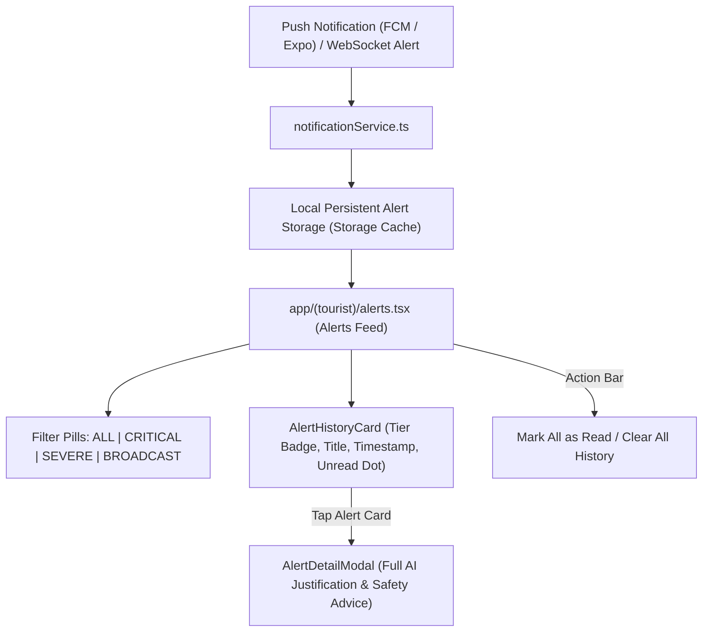

# 📋 Technical Specification — Step 5.8: Tourist Alerts Screen & Push Notification Service

> **Module**: `mobile-app`  
> **Phase**: Phase 5 (Mobile App)  
> **Target Path**: `mobile-app/`  
> **Git Feature Branch**: `feat/step-5-8-tourist-alerts-screen`  
> **Related Architecture**: GEMINI.md Section 6, 9 & 10 (WebSocket Event Architecture & Push Notifications)

---

## 1. Executive Overview

Step 5.8 implements the **Persistent Hazard Alert & Notification History Subsystem** for tourists. While active geofence warnings present intrusive full-screen modals during live boundary breaches (Step 5.5), tourists require an organized, accessible notification feed to review historical safety advisories, sector-wide disaster broadcasts issued by command center administrators (Step 4.13a), and emergency status logs. This screen provides tier filtering (`ALL`, `CRITICAL`, `SEVERE`, `BROADCAST`), unread badge tracking, full AI justification modals, and notification token lifecycle management (`expo-notifications`).

---

## 2. Architectural Responsibilities & Component Breakdown



### Components to Author:
1. **`services/notificationService.ts`**:
   - Manages push notification permissions and token registration (`expo-notifications`).
   - Maintains typed local alert history storage with `getAlerts`, `saveAlert`, `markAsRead`, `markAllAsRead`, and `clearAlerts`.
   - Listens to foreground/background notification events and dispatches to alert storage.
2. **`components/alerts/AlertHistoryCard.tsx`**:
   - Renders individual alert items with tier color styling (`LOW`, `MODERATE`, `SEVERE`, `CRITICAL`, `BROADCAST`, `SOS`).
   - Shows title, sector name, snippet, relative timestamp, and unread indicator dot.
3. **`app/(tourist)/alerts.tsx`**:
   - Tourist Alerts Screen with top filter bar, unread badge counter, empty state, and expanded risk advisory modal.
4. **`__tests__/alerts-screen.test.tsx`**:
   - Comprehensive test suite covering notification registration, tier filtering, mark as read, clear history, and detail modal presentation.

---

## 3. Data Contracts & Models

### 3.1 Alert Item Entity
```typescript
export interface StoredAlert {
  id: string;
  type: 'GEOFENCE' | 'BROADCAST' | 'SOS' | 'SYSTEM';
  tier?: 'LOW' | 'MODERATE' | 'SEVERE' | 'CRITICAL';
  title: string;
  message: string;
  justification?: string;
  zoneId?: string;
  zoneName?: string;
  timestamp: string;
  isRead: boolean;
  actionUrl?: string;
}
```

---

## 4. Mobile Accessibility (A11y) & Usability Invariants

1. **Accessible Filter & Card Targets**: All filter pills, action buttons, and alert list items maintain $\ge 48\times 48\text{dp}$ touch targets.
2. **Screen Reader Descriptions**: Each alert card provides comprehensive `accessibilityLabel` detailing severity tier, title, zone, and unread status.
3. **High-Contrast Badges**: Severity tags use WCAG AAA calibrated contrast backgrounds and text labels.
4. **Empty State Guidance**: Clear visual and screen reader messaging when no hazard alerts are present.

---

## 5. Verification Plan

### Automated Unit & Component Tests (`__tests__/alerts-screen.test.tsx`):
- `should register notification permissions and retrieve expo push token`
- `should save and retrieve alerts from storage service`
- `should render list of safety alerts with correct tier badges`
- `should filter alerts by severity tier (CRITICAL, SEVERE, BROADCAST)`
- `should mark individual and all alerts as read`
- `should clear alert history when clear button is pressed`
- `should display full AI risk assessment modal when alert card is tapped`
- `should render empty state when no alerts exist in category`

### Execution Command:
```bash
cd mobile-app && npm test -- __tests__/alerts-screen.test.tsx
```
