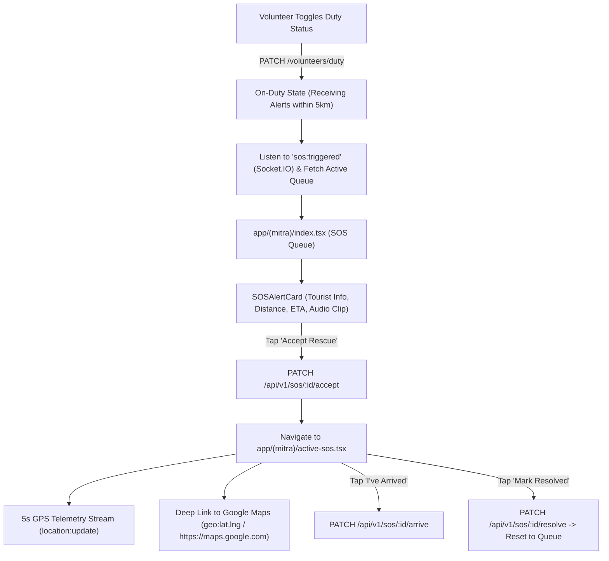

# 📋 Technical Specification — Step 5.9: Yaatri Mitra Volunteer Screens & Real-Time Rescue Flow

> **Module**: `mobile-app`  
> **Phase**: Phase 5 (Mobile App)  
> **Target Path**: `mobile-app/`  
> **Git Feature Branch**: `feat/step-5-9-mitra-volunteer-screens`  
> **Related Architecture**: GEMINI.md Section 6, 9 & 12 (SOS Emergency Dispatch Flow & Yaatri Mitra Persona)

---

## 1. Executive Overview

Step 5.9 implements the **Yaatri Mitra Volunteer Responder Interface** of the Safe Yatra dual-persona mobile application. Certified local volunteers (pilgrimage guides, temple staff, local shopkeepers, mountain porters) serve as first-line immediate responders before formal emergency personnel reach high-altitude or congested pilgrimage sites. This screen suite enables volunteers to toggle on-duty readiness (`PATCH /volunteers/duty`), receive real-time SOS alerts within 5km via WebSocket (`sos:triggered`), 1-tap accept rescues (`PATCH /sos/:id/accept`), launch native turn-by-turn navigation deep links, stream real-time 5-second responder GPS telemetry back to the distressed tourist and command center, confirm arrival (`PATCH /sos/:id/arrive`), and close emergencies (`PATCH /sos/:id/resolve`).

---

## 2. Architectural Responsibilities & Component Breakdown



### Components to Author:
1. **`services/volunteerService.ts`**:
   - API client for Yaatri Mitra operations (`toggleDutyStatus`, `getActiveSOSList`, `acceptSOS`, `arriveSOS`, `resolveSOS`).
2. **`components/mitra/SOSAlertCard.tsx`**:
   - High-visibility rescue dispatch card with tourist coordinates, distance in meters, response ETA, battery level, voice memo playback, and "Accept Rescue" button.
3. **`app/(mitra)/_layout.tsx`**:
   - Yaatri Mitra tab navigator (`index` Dispatch Queue, `active-sos` Live Rescue, `history` Response Log, `profile` Volunteer Profile).
4. **`app/(mitra)/index.tsx`**:
   - Yaatri Mitra Home screen with On-Duty toggle, readiness indicator, and real-time SOS queue.
5. **`app/(mitra)/active-sos.tsx`**:
   - Active rescue navigation view with 5s GPS location streaming, turn-by-turn map launcher, tourist phone dialer, "I've Arrived" arrival confirmation, and "Mark Resolved" resolution handler.
6. **`__tests__/mitra-rescue.test.tsx`**:
   - Comprehensive test suite covering duty toggle, active SOS retrieval, accepting dispatch, maps navigation link, location streaming, arrival, and resolution.

---

## 3. Data Contracts & Navigation Deep Linking

### 3.1 Active Rescue Navigation URL Formats
- Android: `geo:<lat>,<lng>?q=<lat>,<lng>(Tourist Location)`
- Web / Cross-Platform Fallback: `https://www.google.com/maps/dir/?api=1&destination=<lat>,<lng>`

---

## 4. Mobile Accessibility (A11y) & Usability Invariants

1. **Accessible Action Targets**: All toggle switches, emergency accept buttons, call buttons, and resolution buttons meet $\ge 48\times 48\text{dp}$.
2. **High-Contrast Duty State**: Clear visual differentiation between On-Duty (vibrant green `#10B981`) and Off-Duty (slate `#64748B`).
3. **Screen Reader Announcements**: State transitions (e.g. "SOS accepted, navigating to tourist", "Emergency resolved") trigger `AccessibilityInfo.announceForAccessibility`.
4. **Battery & Location Cleanliness**: Location streaming timer (5s interval) and audio playback instances are actively stopped upon navigating away or resolving the emergency.

---

## 5. Verification Plan

### Automated Unit & Component Tests (`__tests__/mitra-rescue.test.tsx`):
- `should toggle volunteer on-duty status`
- `should render list of active emergency distress calls`
- `should accept emergency SOS and transition to active rescue`
- `should open turn-by-turn navigation deep link in maps`
- `should stream responder GPS coordinates on 5-second interval`
- `should trigger arrive and resolve state transitions`

### Execution Command:
```bash
cd mobile-app && npm test -- __tests__/mitra-rescue.test.tsx
```
